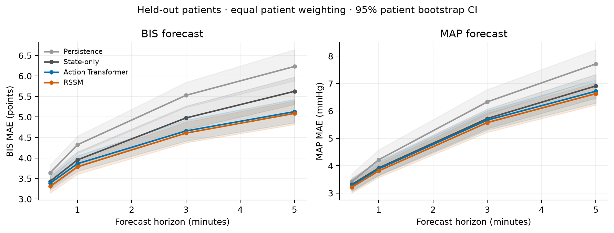

# wm4health

## Round 5 — Multi-horizon headroom audit

The [fifth diagnostic report](experiments/vitaldb_multihorizon_headroom_seed0_v1/outputs/FINAL_REPORT.md) asks whether direct horizon-conditioned prediction has a growing advantage over the unchanged recursive prospective RSSM. It reuses the exact VitalDB cohort and split, reproduces the seed-0 AR predictions exactly, and trains two compact direct controls on the original training-window schedules.

**Result: qualified Outcome B.** Direct-MH's paired BIS MAE advantage grows from 0.017 at 30 seconds to 0.104 at 300 seconds (95% patient-bootstrap CI 0.034–0.187); Direct-Traj also gains 0.060 at 300 seconds. Both use future actions. The improvement is not clearly stronger in high-divergence or upcoming intervention windows. Oracle-State uses later factual physiology, so its large error gap does not isolate recursive drift. The original RSSM already used a full-trajectory training loss; a one-step-objective mismatch is not demonstrated. This supports modest direct-formulation headroom, not a claim that recursive drift has been solved.

- [Report](experiments/vitaldb_multihorizon_headroom_seed0_v1/outputs/FINAL_REPORT.md) · [Configuration](experiments/vitaldb_multihorizon_headroom_seed0_v1/config.yaml) · [Code](experiments/vitaldb_multihorizon_headroom_seed0_v1/src) · [Figures](experiments/vitaldb_multihorizon_headroom_seed0_v1/plots)
- [Metrics and checkpoints](experiments/vitaldb_multihorizon_headroom_seed0_v1/outputs) · [Integrity checks](experiments/vitaldb_multihorizon_headroom_seed0_v1/outputs/integrity_checks.json) · [Completion checks](experiments/vitaldb_multihorizon_headroom_seed0_v1/outputs/completion_checks.json)

## Round 4 — Controlled intervention-support shift

The [fourth diagnostic report](experiments/vitaldb_intervention_support_shift_seed0_v1/outputs/FINAL_REPORT.md) withholds four historical-state × future-drug-action combinations from training a five-seed prospective RSSM ensemble. It compares Full Support (F), Low Support (L), Zero Support (Z), and a matched Random Removal control (R) on the same factual VitalDB test windows. The cohort and patient split are unchanged from earlier rounds.

**Result: Outcome C — the intervention-support reliability gap is not supported.** On 4,105 target windows from 59 test patients, Z−F BIS trajectory MAE is +0.006 (95% patient-bootstrap CI −0.048 to +0.058); Z−R is −0.003 (CI −0.034 to +0.027). The calibrated support gap is not positive. Low-variance/high-error prevalence rises by 1.978 percentage points versus F, but its difference versus R is inconclusive; it does not establish support-specific overconfidence. The experiment evaluates factual outcomes, not treatment counterfactuals.

- [Report](experiments/vitaldb_intervention_support_shift_seed0_v1/outputs/FINAL_REPORT.md) · [Configuration](experiments/vitaldb_intervention_support_shift_seed0_v1/config.yaml) · [Code](experiments/vitaldb_intervention_support_shift_seed0_v1/src) · [Run scripts](experiments/vitaldb_intervention_support_shift_seed0_v1/scripts)
- [Results](experiments/vitaldb_intervention_support_shift_seed0_v1/outputs) · [Seven figures](experiments/vitaldb_intervention_support_shift_seed0_v1/plots) · [Completion checks](experiments/vitaldb_intervention_support_shift_seed0_v1/outputs/completion_checks.json) · [Protocol amendments](experiments/vitaldb_intervention_support_shift_seed0_v1/outputs/protocol_amendments.md)

## Round 3 — Training-support geometry and rollout reliability

The [third diagnostic report](experiments/vitaldb_support_geometry_seed0_v1/outputs/FINAL_REPORT.md) tests whether training-support geometry predicts factual BIS rollout error for held-out patient–intervention queries. It reuses the exact VitalDB cohort and prospective RSSM, trains a five-seed ensemble, and compares state, action, joint, conditional and local tangent support with ensemble uncertainty on 83,198 windows from 74 effective test patients.

**Result: Outcome B — Partial support.** Learned-state kNN distance is associated with error (patient-weighted Spearman 0.292, 95% patient-bootstrap CI 0.215–0.360), but ensemble variance performs better on high-error detection (AUROC/AUPRC 0.705/0.428 versus 0.691/0.367). Conditional action support is weak, and adding the best validation-selected geometry to ensemble variance does not improve test AUROC or risk–coverage. The stronger patient–intervention geometry and support-aware cutoff claims are not established.

- [Final Round-3 report](experiments/vitaldb_support_geometry_seed0_v1/outputs/FINAL_REPORT.md) · [Main trust table](experiments/vitaldb_support_geometry_seed0_v1/outputs/main_trust_table.csv) · [Per-window support scores](experiments/vitaldb_support_geometry_seed0_v1/outputs/support_scores.csv)
- [Code](experiments/vitaldb_support_geometry_seed0_v1/src) · [Configuration](experiments/vitaldb_support_geometry_seed0_v1/config.yaml) · [Figures](experiments/vitaldb_support_geometry_seed0_v1/plots) · [Checks](experiments/vitaldb_support_geometry_seed0_v1/outputs/completion_checks.json)

## Round 2 — Prospective administration schedules

The [prospective-action diagnostic](experiments/vitaldb_prospective_action_seed0_v1/outputs/FINAL_REPORT.md) asks whether a compact RSSM trained with the next five minutes of propofol and remifentanil administration can use that future schedule to predict BIS. It reuses the first experiment's cohort and patient splits and trains a matched historical-action RSSM, a prospective-action RSSM, and two direct supervised informativeness controls. Future physiology and TCI CE do not enter forecasting inputs or losses.

**Result: Outcome C — a prospective controllability gap was not supported.** In 83,198 complete-future-action test windows from 74 patients, the prospective model's patient-weighted full-trajectory BIS MAE was 4.311 with actual future administration and 4.368 when the same model held the current action. The paired Future Action Value was 0.057 (95% patient-bootstrap CI 0.037–0.080), increasing to 0.185 in the highest train-defined schedule-divergence quartile. A matched wrong future schedule raised error by 0.098 overall (CI 0.047–0.140). One original test patient had no complete future-action window; the 75-patient test split itself was unchanged. These observational comparisons do not identify causal treatment effects.

The largest gains depend on brief high-rate administration episodes. A post-diagnostic sensitivity analysis excluding windows above train-derived rate-tail cutoffs substantially reduces FAV; the direct supervised informativeness control loses its gain on the same restricted windows. See the report before interpreting the outcome.

- [Final Round-2 report](experiments/vitaldb_prospective_action_seed0_v1/outputs/FINAL_REPORT.md)
- [Main table](experiments/vitaldb_prospective_action_seed0_v1/outputs/main_table.csv) · [Paired comparisons](experiments/vitaldb_prospective_action_seed0_v1/outputs/paired_comparisons.csv) · [Direct-control information value](experiments/vitaldb_prospective_action_seed0_v1/outputs/future_action_informativeness.csv)
- [Future-action divergence](experiments/vitaldb_prospective_action_seed0_v1/outputs/future_action_divergence_metrics.csv) · [Prospective-event metrics](experiments/vitaldb_prospective_action_seed0_v1/outputs/large_transition_metrics.csv)
- [Code](experiments/vitaldb_prospective_action_seed0_v1/src) · [Configuration](experiments/vitaldb_prospective_action_seed0_v1/config.yaml) · [Figures](experiments/vitaldb_prospective_action_seed0_v1/plots)

## VitalDB intervention-grounding diagnostic — seed 0

第一轮实验的代码与结果。研究问题：准确预测未来生理状态，是否仍可能没有学到药物暴露与给药时序信息？

**本轮结论：Outcome C — Gap not supported（未充分支持所提出的研究缺口）。** 该结论不等于证明模型具有因果或完整生理机制正确性。全队列时移影响较小；较大剂量变化的补充分析在初始诊断后加入，报告保留了这一限制及全部原始分析。

### Results

- [完整实验报告 / Final report](experiments/vitaldb_intervention_grounding_seed0_v1/outputs/FINAL_REPORT.md)
- [主诊断表](experiments/vitaldb_intervention_grounding_seed0_v1/outputs/main_diagnostic_table.csv)
- [原始事件结果](experiments/vitaldb_intervention_grounding_seed0_v1/outputs/transition_diagnostic_table.csv) · [较大剂量变化的补充结果](experiments/vitaldb_intervention_grounding_seed0_v1/outputs/large_transition_diagnostic_table.csv)
- [图表（8 张，PNG/PDF）](experiments/vitaldb_intervention_grounding_seed0_v1/plots)
- [数据摘要](experiments/vitaldb_intervention_grounding_seed0_v1/outputs/data_summary.json) · [病例划分](experiments/vitaldb_intervention_grounding_seed0_v1/outputs/split_caseids.json)
- [配置](experiments/vitaldb_intervention_grounding_seed0_v1/config.yaml) · [代码](experiments/vitaldb_intervention_grounding_seed0_v1/src) · [运行脚本](experiments/vitaldb_intervention_grounding_seed0_v1/scripts)
- [模型权重](experiments/vitaldb_intervention_grounding_seed0_v1/outputs/checkpoints) · [完成检查](experiments/vitaldb_intervention_grounding_seed0_v1/outputs/completion_checks.json) · [协议修订记录](experiments/vitaldb_intervention_grounding_seed0_v1/outputs/protocol_amendments.md)

最终队列包含 **495 个病例、493 位患者**；train/validation/test 分别为 345/74/76 个病例，按患者隔离。仅下载 VitalDB 数值轨迹及元数据，未下载波形。CE 是设备计算的 TCI 参考状态，未进入预测模型的输入或训练损失。

| Model | BIS MAE, full 5-minute trajectory | PPF CE R² | RFTN CE R² | Matched wrong-action MAE increase |
| --- | ---: | ---: | ---: | ---: |
| State-only | 4.640 | — | — | — |
| Action Transformer | 4.375 | 0.675 | 0.743 | 14.98% |
| RSSM | 4.320 | 0.780 | 0.896 | 16.61% |

MAE above is averaged over the full future trajectory and weighted equally by patient. It is distinct from the 5-minute endpoint MAE in the main diagnostic table. Wrong-action degradation uses the matched subset and its corresponding unperturbed baseline.



### Reproduction and artifact scope

See the [experiment README](experiments/vitaldb_intervention_grounding_seed0_v1/README.md) and [recorded environment](experiments/vitaldb_intervention_grounding_seed0_v1/outputs/pip_freeze.txt). Run commands from the experiment directory:

```bash
cd experiments/vitaldb_intervention_grounding_seed0_v1
```

The repository contains the original experiment source, configuration, metadata snapshots, split IDs, preprocessing records, metrics, figures, logs, trained checkpoints and frozen linear-probe coefficients. Original source files are preserved byte-for-byte; their SHA-256 hashes are recorded in `outputs/final_source_sha256.json`.

Raw numeric track CSVs, aligned per-case arrays and full per-window prediction/latent arrays remain on the experiment server and are **not included in this repository**. `src/prepare.py` reacquires numeric data through the official VitalDB API and rebuilds the case arrays; the pipeline regenerates training and evaluation outputs. `scripts/finalize.py` requires those regenerated prediction arrays. The saved completion checks describe verification performed on the server before publication.

The experiment README's server paths describe the original run. To reproduce the recorded report classification after reviewing regenerated metrics, replace its `A_OR_B_OR_C` placeholder with `C` only if the evidence still supports that classification. Rerunning the pipeline writes into the experiment's output directories; use a separate checkout to retain this published snapshot.

### Data provenance

Data come from the [VitalDB Open Dataset](https://vitaldb.net/dataset/) via its [official API](https://vitaldb.net/docs/?documentId=API%2FWeb_API_OpenDataset.md). The original [VitalDB propofol/BIS notebook](https://github.com/vitaldb/examples/blob/master/ppf_bis.ipynb) is retained as a reference under `outputs/official_ppf_bis.ipynb`. Third-party data and the reference notebook retain their upstream terms and attribution.
