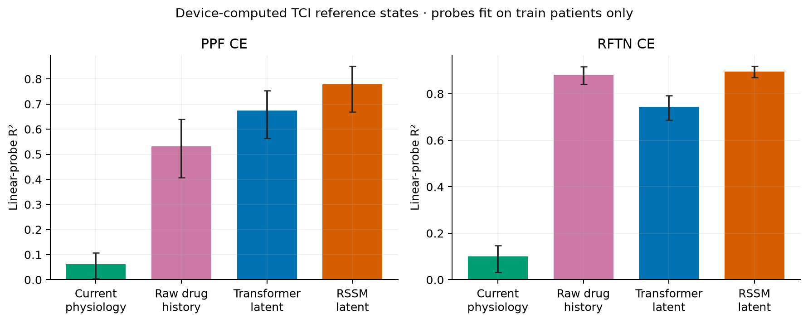
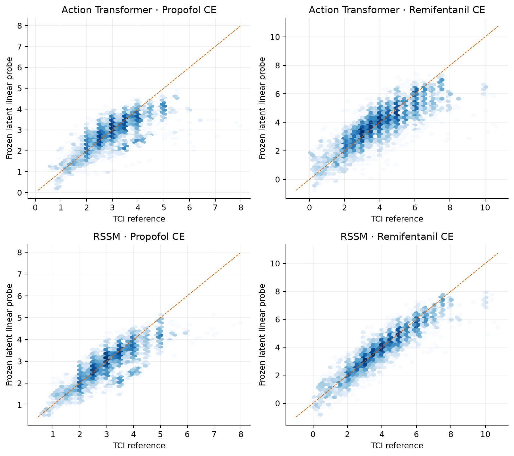
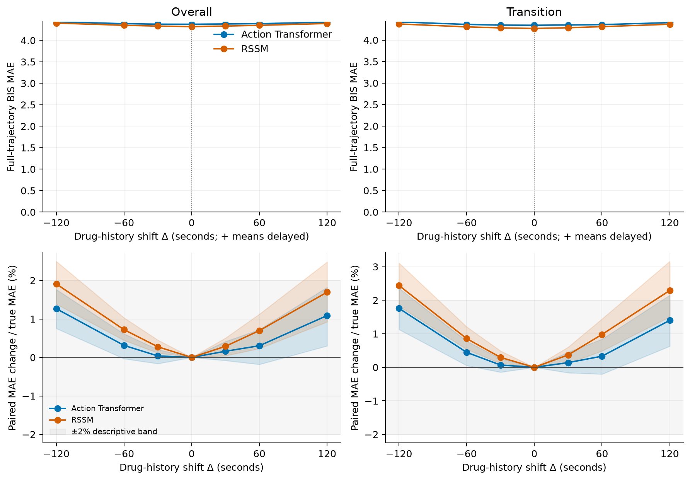
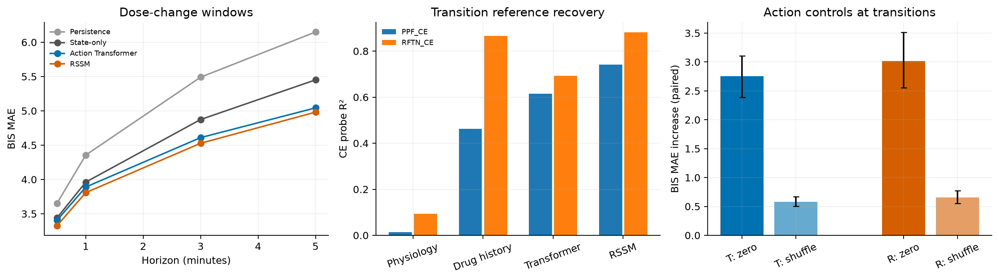
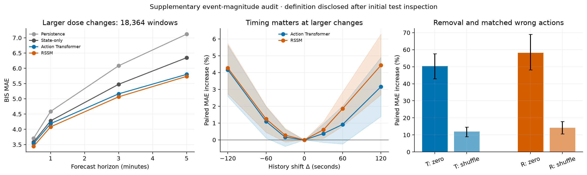
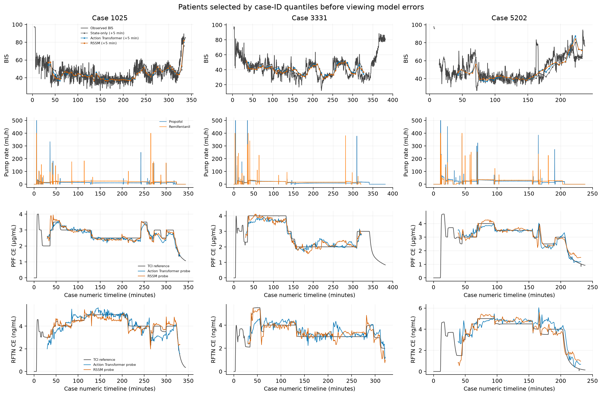
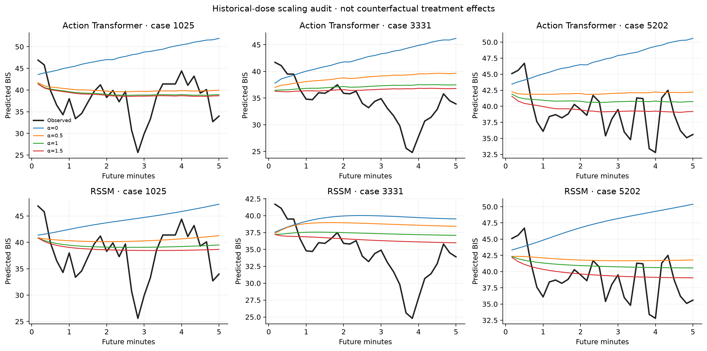

# VitalDB intervention grounding diagnostic, seed 0

**Outcome C — Gap not supported**

This first diagnostic supports **Outcome C: the proposed gap is not sufficiently supported**. Standard action-conditioned baselines both forecast better than state-only and recover substantial TCI drug-exposure information. Their predictions depend strongly on drug history. Correct timing has a modest but structured effect overall and a larger, statistically supported effect around substantial dose changes. These results do not justify starting a second-stage mechanism-grounded architecture from the premise that accurate forecasting has failed to learn exposure dynamics.

- **Forecasting is competent by the predeclared diagnostic standard.** Patient-weighted full-five-minute BIS MAE is 4.640 for State-only, 4.375 for the Action Transformer, and 4.320 for RSSM; persistence is 5.109. Relative to State-only, the action models improve MAE by 5.72% and 6.91%. Paired absolute improvements are 0.265 (95% patient-bootstrap CI 0.186–0.355) and 0.321 (0.234–0.427). These are diagnostic improvements, not claims of clinical deployment readiness or SOTA performance.
- **Weak exposure representation is contradicted.** Transformer latent PPF/RFTN CE R² is 0.675/0.743; RSSM is 0.780/0.896. Current-physiology controls obtain only 0.062/0.101. Adding demographics to current physiology does not explain this advantage. Raw drug history plus demographics gives 0.776/0.974, demonstrating that these references are highly recoverable from the available inputs; learned latents are not perfect sufficient statistics, especially for remifentanil, but exposure information is readily decodable.
- **Action neglect is contradicted.** Zeroing drug histories raises full-trajectory MAE by 60.46% for Transformer and 69.20% for RSSM. Matched wrong histories raise it by 14.98% and 16.61%; absolute paired increases are 0.655 (CI 0.565–0.747) and 0.717 (0.621–0.824). Matching covers 98.45% of test windows and always draws from a different patient. These models materially use the actions.
- **Whole-cohort timing effects are small, but not absent or unstructured.** Both curves attain their lowest point at zero shift. At ±120 seconds, Transformer degradation is 1.09–1.27% and RSSM degradation is 1.69–1.91%. These point estimates satisfy the predeclared descriptive <=2% 'near-flat amplitude' screen. Nevertheless, the ±120-second paired intervals exclude zero, the curves are systematically U-shaped, and some upper confidence limits exceed 2%. Small total-error degradation is not an equivalence test for timing invariance.
- **The larger-change audit argues against a transition-grounding failure.** Its definition was added after the initial Transformer timing audit exposed an inadequate change-magnitude threshold; this exploratory status is disclosed, and original results remain intact. Across 18,364 windows from all 75 test patients, full-trajectory BIS MAE is 5.096 for State-only, 4.820 for Transformer and 4.733 for RSSM. Action-model improvements over State-only are 5.41% and 7.13%, with paired CIs excluding zero. Matched wrong actions increase error by 11.91% and 14.19%. At ±120 seconds, timing degradation increases to 3.16–4.17% and 4.27–4.43%, with both-direction paired intervals excluding zero for both models. This timing error removes approximately 55–73% of the action models' MAE advantage over State-only in these windows; interpreting it as negligible because it is a small fraction of total noisy BIS error would be misleading. Larger-change CE R² remains 0.538/0.537 for Transformer and 0.712/0.832 for RSSM.

The classification is a **failure to establish the proposed research gap**, not proof that either model is a causally correct physiological simulator. CE is device-computed, the data are observational and from one center, only historical actions are supplied, and the extra event-magnitude analysis is post-diagnostic. A single seed and these tests cannot establish universal mechanistic fidelity. Within the requested first-round evidence, however, there is no clear combination of good forecasting with poor exposure recovery, action neglect or failed response to real dose changes. **Do not proceed to a mechanism-grounding method on the basis of this experiment.**

## 1. Cohort construction and exact variables

Source: public VitalDB numeric per-track API. The installed official Python package is used for track-availability cohort queries. Current `load_case` reads full `.vital` containers, so it is intentionally avoided to honor the no-waveform requirement. Official references: [ppf_bis notebook](https://github.com/vitaldb/examples/blob/master/ppf_bis.ipynb), [API documentation](https://vitaldb.net/docs/?documentId=API%2FWeb_API_OpenDataset.md), [numeric track dictionary](https://physionet.org/files/vitaldb/1.0.0/track_names.csv). Copies, track IDs, metadata hashes and package versions are preserved.

Filters: age >18 (matching executable official example), weight >35 kg, General anesthesia, recorded case duration >7200 seconds, BIS, both administration tracks and both CE tracks. Complete plausible demographics are required. Seed 0 randomly selects at most 500 candidates before trajectory quality control. No first-BIS>=80 or last-BIS>=70 filter is used: these endpoint thresholds select clinical outcomes rather than missing-data quality and are unnecessary for history forecasting. Cases require >1 mL total recorded administration for each drug, positive reference CE and at least 30 usable windows.

Cohort counts: `{"all_cases": 6388, "adult_general_weight_duration": 4164, "bis_both_ce": 2225, "both_drug_administration_available": 2225, "complete_plausible_demographics": 2225}`. Selected candidates: **500**. Final eligible cases: **495**, unique patients: **493**. Excluded after selection: 5. Every exclusion and track choice is in `case_preprocessing_log.json`.

Track allowlist: BIS/BIS; Solar8000/HR; Solar8000/ART_MBP, FEM_MBP or NIBP_MBP; Orchestra/PPF20_RATE and RFTN20_RATE; fallback PPF20_VOL/RFTN20_VOL; and PPF20_CE/RFTN20_CE. RATE is mL/h and converted to mL per 10 seconds by dividing by 360; nominal solutions are propofol 20 mg/mL and remifentanil 20 µg/mL. RATE availability must exceed 90% of eligible cases; per-case valid coverage on BIS support must exceed 80%, otherwise volume differences are used. Fallback negative resets and >10 mL/10s increments are marked missing, not interpreted as true zero-dose stops. Actual action-track pairs: `{"Orchestra/PPF20_RATE, Orchestra/RFTN20_RATE": 489, "Orchestra/PPF20_VOL, Orchestra/RFTN20_VOL": 4, "Orchestra/PPF20_VOL, Orchestra/RFTN20_RATE": 2}`. Actual MAP sources: `{"Solar8000/ART_MBP": 335, "Solar8000/NIBP_MBP": 157, "Solar8000/FEM_MBP": 3}`. Data-derived exact usage is recorded per case. The RATE/volume semantics audit is saved in rate_volume_semantics_check.csv; it distinguishes large syringe resets from small negative volume corrections rather than summing only positive differences.

CE is a **device-computed TCI pharmacokinetic reference**, in µg/mL for propofol and ng/mL for remifentanil. It is not a measured concentration. CE, CP and target concentration are excluded from forecasting inputs and losses. Demographics: age, female indicator, weight and height.

## 2. Sampling, missingness and splits

10-second grid; latest valid numeric observation at or before each grid time, never a future observation; maximum carry-forward age 60 seconds. Longer and leading gaps remain missing, become training-mean zero after normalization, and receive explicit availability masks. Raw observed-bin BIS targets exclude forward-filled future labels. Valid ranges: BIS 1–100, HR 20–250/min, MAP 20–200 mmHg; direct RATE 0–3600 mL/h. Leading missing drug values are not treated as known no-infusion time.

History: 180 steps (30 minutes). Forecast: next 30 steps (5 minutes). Windows are generated dynamically at every 10-second anchor; no sliding-window tensors are persisted. A window requires >=80% BIS history coverage, >=95% history coverage for each action, >=90% observed future BIS coverage, current BIS and observed BIS at all four requested horizons. Arterial MAP is preferred when coverage is >=50%; cuff MAP may be a history covariate but is never a MAP target because repeated publication can represent a stale measurement.

Subject IDs, rather than case IDs alone, are shuffled with seed 0 and split approximately 70/15/15. All surgeries of one subject stay together. Exact IDs: `split_caseids.json` and `split_subjectids.json`. Split counts: `{"train": {"cases": 345, "patients": 345, "windows": 374521}, "val": {"cases": 74, "patients": 73, "windows": 80341}, "test": {"cases": 76, "patients": 75, "windows": 83992}}`. All normalization, event thresholds, probe scaling and probe coefficients are derived from training patients only.

## 3. Models and optimization

A/B share a two-layer, width-64, four-head Transformer encoder and a 30-step direct prediction head. Only B receives drug history. C is a compact **deterministic RSSM-style** baseline: two-layer GRU history encoder, 64-dimensional latent, GRUCell action-conditioned future transition, and physiology decoder. It is not a stochastic variational RSSM. Its future rollout holds the last observed action constant; no model receives actual future actions. All have residual prediction from current physiology. Standardized BIS MSE plus 0.25 standardized arterial-MAP MSE trains the entire forecast model. No CE supervision or pretraining is used.

Fixed AdamW settings in config.yaml; at most 20 epochs; up to 80,000 randomly sampled distinct training windows per epoch; validation uses a fixed 60-second stride, early stopping patience 5 and lowest validation BIS MAE checkpoint. Test and probe extraction use all valid 10-second windows. One seed, no hyperparameter search.

| model | parameters | best_epoch | epochs_run | best_validation_bis_mae | train_windows_available | train_windows_per_epoch | seconds | device |
| --- | --- | --- | --- | --- | --- | --- | --- | --- |
| State-only | 103612 | 4 | 9 | 4.245 | 374521 | 80000 | 100.533 | cuda |
| Action Transformer | 103868 | 3 | 8 | 4.004 | 374521 | 80000 | 91.570 | cuda |
| RSSM | 58946 | 11 | 16 | 3.965 | 374521 | 80000 | 241.499 | cuda |

## 4. Forecasting results

Point-horizon errors measure precisely t+30,60,180,300 seconds. The full-trajectory error averages all observed points in the next five minutes. Primary aggregation weights patients equally, first averaging windows within patient; RMSE is the square root of patient-weighted MSE. Paired uncertainty uses 1,000 patient-cluster bootstrap replicates, preserving serial and cross-case dependence within patients. Pooled-window MAE is also saved. Persistence repeats current physiology and tests whether 'good forecasting' exceeds an autoregressive shortcut.

| Model | BIS MAE 30s | BIS MAE 1m | BIS MAE 3m | BIS MAE 5m | PPF_CE R2 | RFTN_CE R2 | ARD | MWAD | Timing max |TD| % |
| --- | --- | --- | --- | --- | --- | --- | --- | --- | --- |
| Persistence | 3.640 | 4.324 | 5.528 | 6.232 | NA | NA | NA | NA | NA |
| State-only | 3.433 | 3.955 | 4.977 | 5.626 | NA | NA | NA | NA | NA |
| Action Transformer | 3.387 | 3.862 | 4.660 | 5.130 | 0.675 | 0.743 | 2.645 | 0.655 | 1.267 |
| RSSM | 3.310 | 3.786 | 4.608 | 5.088 | 0.780 | 0.896 | 2.989 | 0.717 | 1.910 |

Timing column is max absolute full-trajectory TD across the prescribed shifts. ARD/MWAD are absolute BIS MAE increases, averaged over five minutes; MWAD uses the matched subset and its own paired true-action error.

| model | horizon_label | mae | mae_ci_low | mae_ci_high | rmse | n_windows | n_patients |
| --- | --- | --- | --- | --- | --- | --- | --- |
| Persistence | 30s | 3.640 | 3.449 | 3.836 | 5.015 | 83992 | 75 |
| Persistence | 60s | 4.324 | 4.110 | 4.534 | 5.928 | 83992 | 75 |
| Persistence | 180s | 5.528 | 5.233 | 5.845 | 7.763 | 83992 | 75 |
| Persistence | 300s | 6.232 | 5.880 | 6.643 | 8.983 | 83992 | 75 |
| Persistence | full_5min_trajectory | 5.109 | 4.839 | 5.391 | 7.312 | 83992 | 75 |
| State-only | 30s | 3.433 | 3.264 | 3.606 | 4.625 | 83992 | 75 |
| State-only | 60s | 3.955 | 3.765 | 4.149 | 5.375 | 83992 | 75 |
| State-only | 180s | 4.977 | 4.694 | 5.265 | 7.014 | 83992 | 75 |
| State-only | 300s | 5.626 | 5.305 | 5.973 | 8.173 | 83992 | 75 |
| State-only | full_5min_trajectory | 4.640 | 4.384 | 4.897 | 6.639 | 83992 | 75 |
| Action Transformer | 30s | 3.387 | 3.222 | 3.558 | 4.571 | 83992 | 75 |
| Action Transformer | 60s | 3.862 | 3.677 | 4.055 | 5.218 | 83992 | 75 |
| Action Transformer | 180s | 4.660 | 4.414 | 4.923 | 6.426 | 83992 | 75 |
| Action Transformer | 300s | 5.130 | 4.861 | 5.430 | 7.209 | 83992 | 75 |
| Action Transformer | full_5min_trajectory | 4.375 | 4.159 | 4.613 | 6.102 | 83992 | 75 |
| RSSM | 30s | 3.310 | 3.147 | 3.477 | 4.475 | 83992 | 75 |
| RSSM | 60s | 3.786 | 3.603 | 3.977 | 5.115 | 83992 | 75 |
| RSSM | 180s | 4.608 | 4.373 | 4.874 | 6.333 | 83992 | 75 |
| RSSM | 300s | 5.088 | 4.818 | 5.392 | 7.140 | 83992 | 75 |
| RSSM | full_5min_trajectory | 4.320 | 4.112 | 4.557 | 6.016 | 83992 | 75 |

Paired full-trajectory comparisons:

| model | reference_model | subset | horizon_seconds | mae_improvement | ci_low | ci_high | relative_improvement | n_patients |
| --- | --- | --- | --- | --- | --- | --- | --- | --- |
| State-only | Persistence | overall | 0 | 0.468 | 0.358 | 0.560 | 0.092 | 75 |
| State-only | Persistence | transition | 0 | 0.521 | 0.414 | 0.616 | 0.102 | 75 |
| Action Transformer | Persistence | overall | 0 | 0.734 | 0.645 | 0.821 | 0.144 | 75 |
| Action Transformer | Persistence | transition | 0 | 0.739 | 0.651 | 0.831 | 0.145 | 75 |
| Action Transformer | State-only | overall | 0 | 0.265 | 0.186 | 0.355 | 0.057 | 75 |
| Action Transformer | State-only | transition | 0 | 0.218 | 0.141 | 0.308 | 0.048 | 75 |
| RSSM | Persistence | overall | 0 | 0.789 | 0.706 | 0.884 | 0.154 | 75 |
| RSSM | Persistence | transition | 0 | 0.814 | 0.718 | 0.913 | 0.160 | 75 |
| RSSM | State-only | overall | 0 | 0.321 | 0.234 | 0.427 | 0.069 | 75 |
| RSSM | State-only | transition | 0 | 0.293 | 0.202 | 0.401 | 0.064 | 75 |

## 5. Frozen representation probes

Entire forecasting checkpoints are frozen. A separate ridge linear probe (alpha=100; train-only feature standardization) is fit to each CE using **all valid training windows** with equal total patient weight. No encoder update or test CE fitting occurs. Required controls use only current BIS/HR/MAP with availability flags, or the uncompressed 180x2 raw-dose history with two missing-fraction indicators. Supplemental controls add the same four demographics to each of these inputs, checking whether apparent latent information merely reflects patient characteristics available to the forecasting model. No CE appears in any control input. R² and Pearson use pooled moments with equal patient mass; patient bootstrap supplies confidence intervals. Negative R² values are retained.

| representation | drug | r2 | r2_ci_low | r2_ci_high | mae | pearson | n_patients |
| --- | --- | --- | --- | --- | --- | --- | --- |
| Current physiology | PPF_CE | 0.062 | 0.004 | 0.107 | 0.563 | 0.259 | 75 |
| Current physiology | RFTN_CE | 0.101 | 0.032 | 0.146 | 1.068 | 0.332 | 75 |
| Raw drug history | PPF_CE | 0.532 | 0.407 | 0.640 | 0.398 | 0.738 | 75 |
| Raw drug history | RFTN_CE | 0.883 | 0.840 | 0.917 | 0.374 | 0.941 | 75 |
| Physiology + demographics | PPF_CE | 0.115 | 0.033 | 0.183 | 0.556 | 0.358 | 75 |
| Physiology + demographics | RFTN_CE | 0.091 | 0.025 | 0.135 | 1.081 | 0.316 | 75 |
| Drug history + demographics | PPF_CE | 0.776 | 0.637 | 0.857 | 0.255 | 0.885 | 75 |
| Drug history + demographics | RFTN_CE | 0.974 | 0.965 | 0.981 | 0.155 | 0.987 | 75 |
| Action Transformer | PPF_CE | 0.675 | 0.565 | 0.754 | 0.311 | 0.822 | 75 |
| Action Transformer | RFTN_CE | 0.743 | 0.688 | 0.792 | 0.517 | 0.863 | 75 |
| RSSM | PPF_CE | 0.780 | 0.669 | 0.852 | 0.252 | 0.884 | 75 |
| RSSM | RFTN_CE | 0.896 | 0.869 | 0.920 | 0.317 | 0.947 | 75 |

## 6. Removal and matched wrong actions

Zero-action sets physical doses to zero while keeping masks. Matched shuffle uses another test **patient**, requires each current BIS/HR/MAP difference <=0.5 training SD and action-history RMS difference >=0.25 training dose SD, and searches the 128 nearest physiological candidates. No-match windows are excluded only from shuffle comparisons. All test CE and future outcomes are excluded from matching. Match coverage and balance: `{"test_windows": 83992, "matched_windows": 82686, "matched_fraction": 0.9844509000857224, "different_patient": true, "state_caliper_each_train_sd": 0.5, "minimum_action_history_rms_train_sd": 0.25, "state_absolute_difference_medians": {"bis_difference": 0.2999992370605469, "hr_difference": 0.0, "map_difference": 0.0}}`.

| model | intervention | subset | true_mae | perturbed_mae | degradation | delta_ci_low | delta_ci_high | n_windows |
| --- | --- | --- | --- | --- | --- | --- | --- | --- |
| Action Transformer | zero_action | overall | 4.375 | 7.020 | 2.645 | 2.322 | 2.982 | 83992 |
| Action Transformer | zero_action | transition | 4.345 | 7.098 | 2.753 | 2.391 | 3.105 | 52839 |
| Action Transformer | matched_shuffle | overall | 4.370 | 5.025 | 0.655 | 0.565 | 0.747 | 82686 |
| Action Transformer | matched_shuffle | transition | 4.338 | 4.919 | 0.581 | 0.504 | 0.667 | 51929 |
| RSSM | zero_action | overall | 4.320 | 7.309 | 2.989 | 2.514 | 3.522 | 83992 |
| RSSM | zero_action | transition | 4.270 | 7.289 | 3.019 | 2.551 | 3.510 | 52839 |
| RSSM | matched_shuffle | overall | 4.316 | 5.033 | 0.717 | 0.621 | 0.824 | 82686 |
| RSSM | matched_shuffle | transition | 4.264 | 4.919 | 0.655 | 0.555 | 0.770 | 51929 |

## 7. Timing perturbation

Only historical actions are shifted simultaneously. Positive Δ delays them, negative Δ advances them within the observed history. Edge replication pads unavailable shifted regions; there is no wrap and no reading beyond the forecast anchor. Associated action availability masks move with their samples. Physics history, target, demographics and weights remain fixed. Dose perturbation size is reported because a flat curve during constant infusion carries little diagnostic information.

| model | subset | shift_seconds | mae | rmse | delta_mae | delta_ci_low | delta_ci_high | normalized_degradation | action_mean_abs_change_ml_per_10s |
| --- | --- | --- | --- | --- | --- | --- | --- | --- | --- |
| Action Transformer | overall | -120 | 4.430 | 6.176 | 0.055 | 0.033 | 0.077 | 0.013 | 0.018 |
| Action Transformer | transition | -120 | 4.421 | 6.108 | 0.076 | 0.049 | 0.103 | 0.018 | 0.022 |
| Action Transformer | overall | -60 | 4.389 | 6.116 | 0.014 | -0.001 | 0.027 | 0.003 | 0.016 |
| Action Transformer | transition | -60 | 4.364 | 6.025 | 0.019 | 0.002 | 0.034 | 0.004 | 0.020 |
| Action Transformer | overall | -30 | 4.377 | 6.101 | 0.002 | -0.007 | 0.009 | 0.000 | 0.014 |
| Action Transformer | transition | -30 | 4.348 | 6.005 | 0.003 | -0.006 | 0.011 | 0.001 | 0.018 |
| Action Transformer | overall | 0 | 4.375 | 6.102 | 0.000 | 0.000 | 0.000 | 0.000 | 0.000 |
| Action Transformer | transition | 0 | 4.345 | 6.007 | 0.000 | 0.000 | 0.000 | 0.000 | 0.000 |
| Action Transformer | overall | 30 | 4.382 | 6.126 | 0.007 | -0.003 | 0.018 | 0.002 | 0.014 |
| Action Transformer | transition | 30 | 4.351 | 6.029 | 0.006 | -0.007 | 0.020 | 0.001 | 0.018 |
| Action Transformer | overall | 60 | 4.388 | 6.152 | 0.013 | -0.008 | 0.032 | 0.003 | 0.016 |
| Action Transformer | transition | 60 | 4.359 | 6.055 | 0.014 | -0.009 | 0.037 | 0.003 | 0.020 |
| Action Transformer | overall | 120 | 4.423 | 6.225 | 0.048 | 0.013 | 0.080 | 0.011 | 0.018 |
| Action Transformer | transition | 120 | 4.406 | 6.141 | 0.061 | 0.027 | 0.094 | 0.014 | 0.022 |
| RSSM | overall | -120 | 4.402 | 6.143 | 0.083 | 0.060 | 0.108 | 0.019 | 0.018 |
| RSSM | transition | -120 | 4.375 | 6.054 | 0.104 | 0.078 | 0.133 | 0.024 | 0.022 |
| RSSM | overall | -60 | 4.351 | 6.060 | 0.031 | 0.019 | 0.045 | 0.007 | 0.016 |
| RSSM | transition | -60 | 4.307 | 5.948 | 0.037 | 0.023 | 0.052 | 0.009 | 0.020 |
| RSSM | overall | -30 | 4.332 | 6.029 | 0.012 | 0.005 | 0.020 | 0.003 | 0.014 |
| RSSM | transition | -30 | 4.283 | 5.912 | 0.013 | 0.005 | 0.021 | 0.003 | 0.018 |
| RSSM | overall | 0 | 4.320 | 6.016 | 0.000 | 0.000 | 0.000 | 0.000 | 0.000 |
| RSSM | transition | 0 | 4.270 | 5.897 | 0.000 | 0.000 | 0.000 | 0.000 | 0.000 |
| RSSM | overall | 30 | 4.332 | 6.049 | 0.013 | 0.002 | 0.022 | 0.003 | 0.014 |
| RSSM | transition | 30 | 4.286 | 5.934 | 0.016 | 0.005 | 0.026 | 0.004 | 0.018 |
| RSSM | overall | 60 | 4.350 | 6.095 | 0.030 | 0.010 | 0.049 | 0.007 | 0.016 |
| RSSM | transition | 60 | 4.312 | 5.991 | 0.042 | 0.021 | 0.062 | 0.010 | 0.020 |
| RSSM | overall | 120 | 4.393 | 6.187 | 0.073 | 0.040 | 0.107 | 0.017 | 0.018 |
| RSSM | transition | 120 | 4.368 | 6.100 | 0.098 | 0.064 | 0.135 | 0.023 | 0.022 |

## 8. Transition-event evaluation

For each drug, compare adjacent one-minute median administration windows, requiring all 12 samples to be valid. 'On' is the training positive-dose 10th percentile; substantial change is the training 75th percentile of nonzero absolute median changes. Thresholds (mL/10s): `[{"on": 0.035172220319509506, "change": 0.0009763911366462708}, {"on": 0.0353027768433094, "change": 0.0009416788816452026}]`. Initiation requires a zero pre-median and a post-median above the on threshold; stop requires the reverse. Numerical zero tolerance is 1e-6 mL/10s. Ongoing increases/decreases require two positive medians and cross the magnitude threshold. This pre-evaluation clarification is documented in protocol_amendments.md. Detections for one drug are at least two minutes apart. Evaluation anchors are from confirmation through the next two minutes, so the observed change is in history. Initial induction before a full 30-minute history is not represented; later initiations/restarts are. These are observational pump-record changes, not randomized interventions. Separate event-type counts/errors, transition probes and timing curves are saved.

| Model | BIS MAE 30s | BIS MAE 1m | BIS MAE 3m | BIS MAE 5m | PPF_CE R2 | RFTN_CE R2 | ARD | MWAD | Timing max |TD| % |
| --- | --- | --- | --- | --- | --- | --- | --- | --- | --- |
| Persistence | 3.653 | 4.355 | 5.491 | 6.149 | NA | NA | NA | NA | NA |
| State-only | 3.441 | 3.961 | 4.874 | 5.451 | NA | NA | NA | NA | NA |
| Action Transformer | 3.406 | 3.890 | 4.610 | 5.043 | 0.615 | 0.694 | 2.753 | 0.581 | 1.759 |
| RSSM | 3.327 | 3.808 | 4.528 | 4.981 | 0.741 | 0.881 | 3.019 | 0.655 | 2.441 |

| representation | drug | r2 | mae | pearson | n_windows | n_patients |
| --- | --- | --- | --- | --- | --- | --- |
| Current physiology | PPF_CE | 0.014 | 0.544 | 0.217 | 52805 | 75 |
| Current physiology | RFTN_CE | 0.094 | 1.025 | 0.352 | 52808 | 75 |
| Raw drug history | PPF_CE | 0.463 | 0.400 | 0.698 | 52805 | 75 |
| Raw drug history | RFTN_CE | 0.866 | 0.382 | 0.932 | 52808 | 75 |
| Physiology + demographics | PPF_CE | 0.051 | 0.543 | 0.315 | 52805 | 75 |
| Physiology + demographics | RFTN_CE | 0.080 | 1.039 | 0.335 | 52808 | 75 |
| Drug history + demographics | PPF_CE | 0.747 | 0.255 | 0.868 | 52805 | 75 |
| Drug history + demographics | RFTN_CE | 0.971 | 0.157 | 0.986 | 52808 | 75 |
| Action Transformer | PPF_CE | 0.615 | 0.319 | 0.786 | 52805 | 75 |
| Action Transformer | RFTN_CE | 0.694 | 0.544 | 0.836 | 52808 | 75 |
| RSSM | PPF_CE | 0.741 | 0.258 | 0.862 | 52805 | 75 |
| RSSM | RFTN_CE | 0.881 | 0.328 | 0.939 | 52808 | 75 |

### 8.1. Supplementary larger-change audit

Inspecting the initial protocol revealed that its 75th-percentile nonzero one-minute changes were only 0.3515 and 0.3390 mL/h. They include many small automatic pump adjustments and should not by themselves be described as substantial dose changes. After the initial Transformer timing results were inspected, a supplementary definition was added using only TRAIN administration values: the larger-change threshold is the maximum of the original threshold and half the IQR of positive administration rates. This yields **4.402 mL/h propofol and 6.668 mL/h remifentanil**. Initiation and stop retain their genuine zero-crossing definitions. The original analysis is retained in every result file; rows with subset `large_transition` and the `large_change_*` files contain this supplementary audit. This is an explicitly exploratory protocol extension, not a preregistered confirmatory result. No model, normalization, checkpoint or probe was refit.

Larger-change subset: **18364 windows**, **76 cases**, **75 patients**. Window counts by type (0 excluded, 1 initiation, 2 increase, 3 decrease, 4 stop): `{"0": 65628, "1": 4119, "2": 3005, "3": 10560, "4": 680}`. See `large_change_protocol.json` for exact training quantiles, timestamp and the frozen definition. The transition files include both original and larger-event results.

| Model | BIS MAE 30s | BIS MAE 1m | BIS MAE 3m | BIS MAE 5m | PPF_CE R2 | RFTN_CE R2 | ARD | MWAD | Timing max |TD| % |
| --- | --- | --- | --- | --- | --- | --- | --- | --- | --- |
| Persistence | 3.706 | 4.586 | 6.083 | 7.119 | NA | NA | NA | NA | NA |
| State-only | 3.583 | 4.278 | 5.475 | 6.348 | NA | NA | NA | NA | NA |
| Action Transformer | 3.535 | 4.186 | 5.163 | 5.802 | 0.538 | 0.537 | 2.427 | 0.574 | 4.166 |
| RSSM | 3.443 | 4.081 | 5.065 | 5.736 | 0.712 | 0.832 | 2.754 | 0.672 | 4.434 |

| model | reference_model | subset | horizon_seconds | mae_improvement | ci_low | ci_high | relative_improvement | n_patients |
| --- | --- | --- | --- | --- | --- | --- | --- | --- |
| Action Transformer | Persistence | large_transition | 0 | 0.772 | 0.614 | 0.931 | 0.138 | 75 |
| Action Transformer | State-only | large_transition | 0 | 0.276 | 0.150 | 0.390 | 0.054 | 75 |
| RSSM | Persistence | large_transition | 0 | 0.859 | 0.670 | 1.036 | 0.154 | 75 |
| RSSM | State-only | large_transition | 0 | 0.363 | 0.209 | 0.517 | 0.071 | 75 |

| model | shift_seconds | mae | delta_mae | delta_ci_low | delta_ci_high | normalized_degradation |
| --- | --- | --- | --- | --- | --- | --- |
| Action Transformer | -120 | 5.021 | 0.201 | 0.125 | 0.271 | 0.042 |
| Action Transformer | -60 | 4.873 | 0.053 | 0.005 | 0.095 | 0.011 |
| Action Transformer | -30 | 4.828 | 0.008 | -0.018 | 0.031 | 0.002 |
| Action Transformer | 0 | 4.820 | 0.000 | 0.000 | 0.000 | 0.000 |
| Action Transformer | 30 | 4.838 | 0.018 | -0.007 | 0.047 | 0.004 |
| Action Transformer | 60 | 4.864 | 0.044 | -0.012 | 0.098 | 0.009 |
| Action Transformer | 120 | 4.972 | 0.152 | 0.067 | 0.236 | 0.032 |
| RSSM | -120 | 4.935 | 0.202 | 0.129 | 0.271 | 0.043 |
| RSSM | -60 | 4.791 | 0.059 | 0.021 | 0.095 | 0.012 |
| RSSM | -30 | 4.746 | 0.013 | -0.006 | 0.032 | 0.003 |
| RSSM | 0 | 4.733 | 0.000 | 0.000 | 0.000 | 0.000 |
| RSSM | 30 | 4.761 | 0.029 | 0.004 | 0.051 | 0.006 |
| RSSM | 60 | 4.820 | 0.088 | 0.038 | 0.135 | 0.019 |
| RSSM | 120 | 4.942 | 0.210 | 0.127 | 0.297 | 0.044 |

## 9. Representative patients and dose scaling

The three patients are fixed at the 15th, 50th and 85th percentiles of sorted test case IDs, independent of model errors. Trajectory plots compare observed BIS to 5-minute-ahead predictions, pump rates, TCI CE and frozen-latent CE predictions. Dose-scaling anchors use the middle transition window when available, otherwise the middle usable window. Scaling historical administration by 0, 0.5, 1 and 1.5 is an input-response audit; it does **not** estimate counterfactual treatment effects or require universal monotonicity.

## 10. Integrity, interpretation and limits

Focused checks: `{"patient_split_disjoint": true, "ce_mutation_no_input_effect": true, "future_state_and_action_no_input_effect": true, "no_backward_fill_or_long_gap_interpolation": true, "shift_sign_padding_no_wrap": true, "zero_means_physical_zero": true, "models_shapes_and_backward": true, "state_model_action_independent": true, "feature_allowlist": ["past_BIS_HR_MAP", "past_drug_administration", "demographics", "availability_masks"], "forbidden_features": ["CE", "CP", "CT", "future_states", "future_actions", "caseid", "subjectid"]}`. All three models use identical cases and usable anchor rules. Predictions, checkpoints, per-patient matching, configuration and numeric source provenance are retained. No waveform or full-case container was downloaded.

The preregistered diagnostic thresholds are descriptive, not clinical standards. Good forecasting requires full-trajectory BIS MAE <=5 and >=5% improvement on persistence. Meaningful action gain requires >=5% improvement on state-only with paired CI excluding zero. Strong CE recovery requires both R²>=0.5 and >=0.1 above instantaneous physiology; near-flat timing means all |TD|<=2%. Those thresholds cannot establish physical or causal fidelity. Linear probes test readily decodable TCI-reference information, not all information in a nonlinear latent. Historical-input perturbations condition on physiology that already reflects past drug exposure; predictive insensitivity does not uniquely prove absence of a drug mechanism. TCI-controlled rates, unobserved surgery/other drugs, one center, one seed, a short horizon, unknown future actions, overlapping windows and a deterministic compact RSSM limit generalization. A flat timing curve must be considered together with perturbation magnitude and dose-change results.

**Final evidence classification: Outcome C — Gap not supported.**
