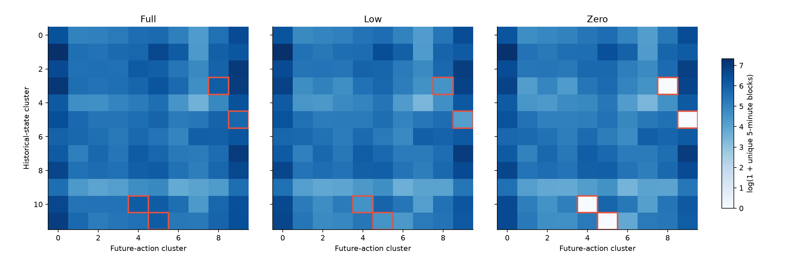
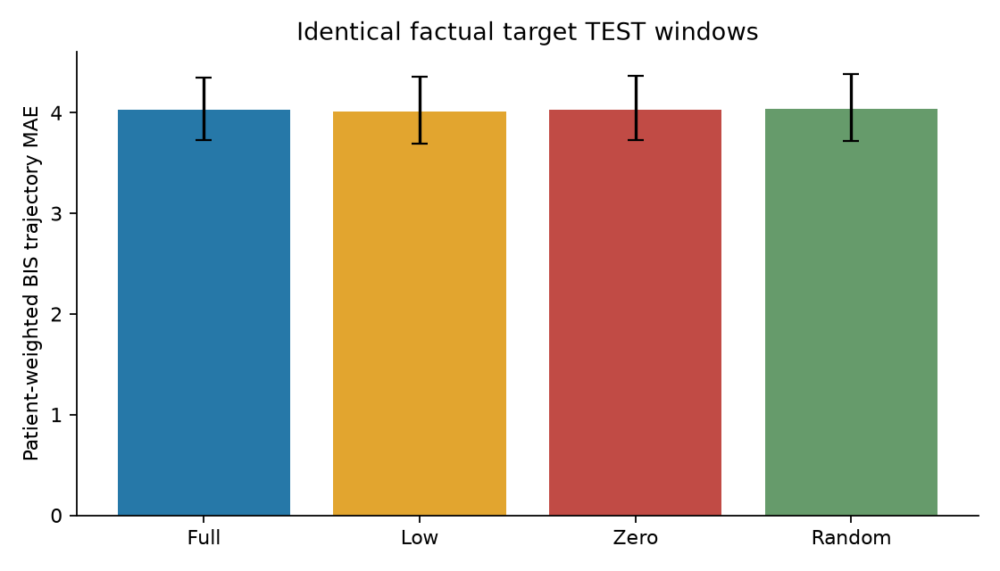
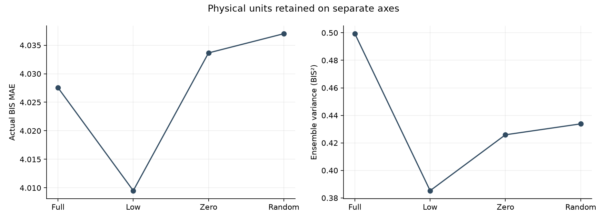
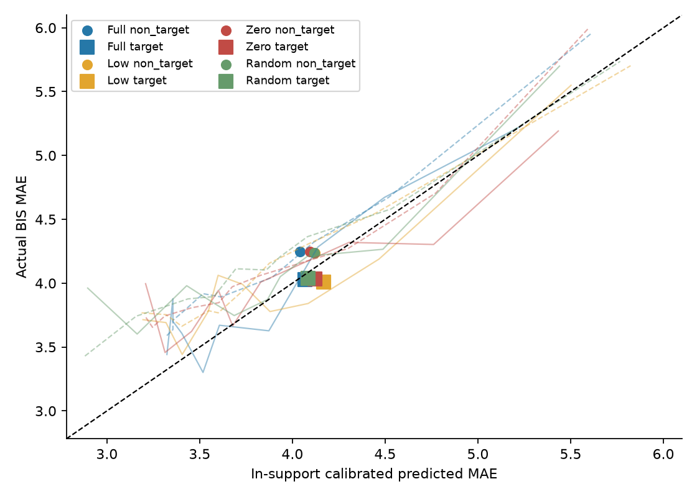
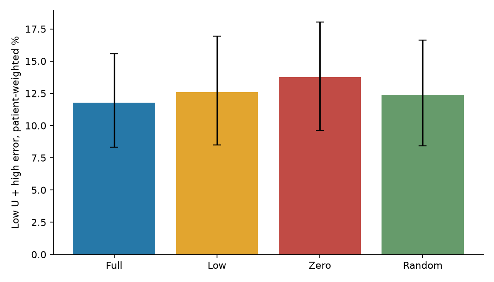
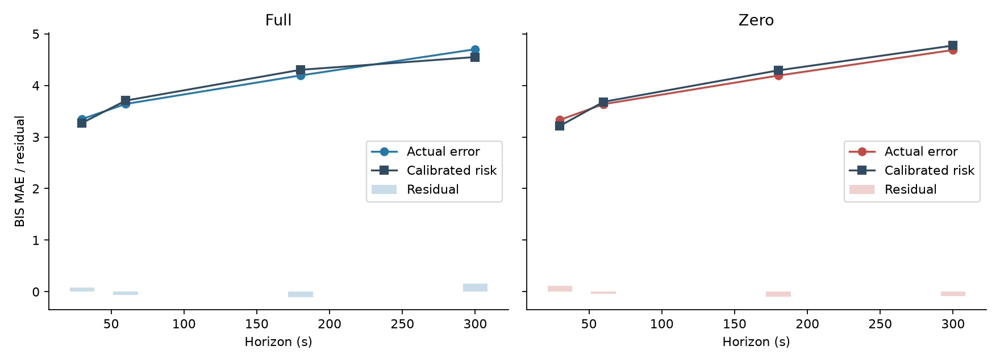
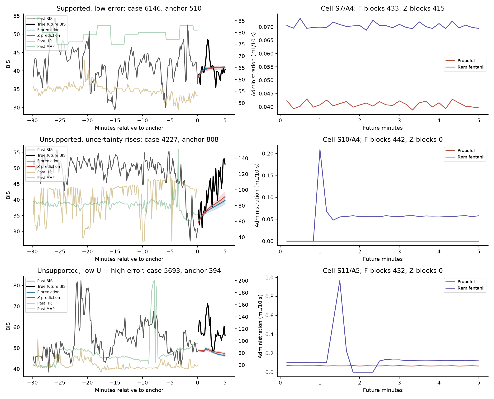

# VitalDB intervention-support shift, seed 0

**Outcome C — Gap not supported.**

## Controlled design
The unmodified numeric-only VitalDB cohort contains 495 cases / 493 patients, with identical 345/74/76 case and 345/73/75 subject-disjoint TRAIN/VAL/TEST splits. Complete prospective-action windows are 370,566/79,574/83,198; the effective TEST set has 74 patients. Ten-second sampling, 30-minute history, five-minute future BIS/MAP, demographics, masks and normalization are inherited. CE never enters clustering or the forecast model. All evaluated future physiology is factual and observed; withholding a training combination does not identify a treatment counterfactual.

Exact track provenance is the unchanged Round-1 per-case log: BIS/BIS, Solar8000/HR, arterial/femoral/NIBP mean pressure, Orchestra/PPF20_RATE and RFTN20_RATE (mL/h converted to mL/10 s) with PPF20_VOL/RFTN20_VOL differencing fallback. PPF20_CE/RFTN20_CE were acquired as device-computed references in Round 1 but are unused here. Age, sex, weight and height are the demographics. See the Round-1 report and `case_preprocessing_log.json` for each case’s selected track and numeric missingness decision.

TRAIN-only clustering chose 12 historical-state clusters and 10 future-action clusters by silhouette with minimum-size screening. State summaries use current BIS/HR/MAP, trailing 1/5-minute mean, standard deviation, minimum, maximum and change, plus demographics. Action summaries use the Round-3 14 dose-trajectory features; no future physiology participates. The selected cells are [(11, 5), (3, 8), (5, 9), (10, 4)]. Selection used only TRAIN support and VAL/TEST evaluability counts, with threshold relaxation stage 0. Figure 1 and the selection table show every cell.

Two construction-stage revisions made before inspecting Round-4 TEST outcomes are documented in `protocol_amendments.md`: four distinct action clusters replaced a duplicate-action prototype, and the Random control was repaired to match touched blocks as well as margins.

| Condition | TRAIN windows | Removed windows | Target blocks | Target patients |
|---|---:|---:|---:|---:|
| F | 370566 | 0 | 1596 | 226 |
| L | 316317 | 54249 | 328 | 45 |
| Z | 301409 | 69157 | 0 | 0 |
| R | 301409 | 69157 | 1596 | 226 |

L retains approximately 20% of target blocks by selecting complete target patients; Z purges every target anchor and all same-case windows within ±300 seconds. R removes the same number of windows, touches the same number of five-minute blocks and patients/cases as Z, exactly matches state and action marginal removal counts, and retains all target-cell windows. R is an intervention-specific volume control, not an independent random draw of patients. Model architecture, objective, 80,000 sampled windows/epoch, AdamW, 20-epoch cap, patience five and validation stride six are unchanged. All L/Z/R seeds use only VAL_trainlike for early stopping; target-cell validation windows are held aside. Five full-support checkpoints and predictions match Round 3 bitwise. Those F checkpoints were originally selected on the full Round-3 validation set; their checkpoint-selection split therefore differs from the new conditions, a limitation for small contrasts.
The R block set is chosen by a deterministic mixed-integer capacity optimization restricted to the same affected patients; a linear transportation allocation then gives exact state/action marginal quotas, with at least one removed window per selected block. Both programs and random seeds are saved in `scripts/optimize_random_blocks.py` and `scripts/apply_random_blocks.py`. The realized manifest, not a planned sampling target, is the training mask.

The removal pattern within touched blocks is not identical: median removed fraction is 1.000 for Z and 0.833 for R. `random_control_balance.csv` gives block and patient distributions; this residual temporal-pattern mismatch limits attribution if effects are small.

## Primary factual TEST comparison
| Training condition | Target 5m MAE | Non-target 5m MAE | Ensemble U (BIS²) | Predicted risk | Calibration residual | High-error AUROC | Confidently-wrong % |
|---|---:|---:|---:|---:|---:|---:|---:|
| Full support | 4.028 [3.729, 4.346] | 4.245 | 0.499 | 4.067 | -0.039 | 0.641 | 11.773 |
| Low support | 4.010 [3.696, 4.355] | 4.239 | 0.385 | 4.167 | -0.157 | 0.564 | 12.607 |
| Zero support | 4.034 [3.726, 4.367] | 4.247 | 0.426 | 4.123 | -0.089 | 0.602 | 13.751 |
| Random removal | 4.037 [3.716, 4.385] | 4.239 | 0.434 | 4.086 | -0.049 | 0.612 | 12.390 |

On exactly 4105 target TEST windows from 59 patients, paired patient-bootstrap ΔE(Z−F) = 0.006 [-0.048, 0.058] BIS; ΔE(Z−R) = -0.003 [-0.034, 0.027]. ΔU(Z−F) = -0.073 [-0.219, 0.047] BIS². All intervals use 1,000 patient-cluster resamples; windows are never independent replicates.

Separate per-condition isotonic maps fitted only on VAL_trainlike convert ensemble variance to expected absolute BIS error. Target-minus-comparable in-support support-calibration gap for Z is -0.070 [-0.341, 0.190] BIS; its paired Z−F change is 0.019 [-0.106, 0.145]. Comparable means same-state/different-action OR same-action/different-state TEST windows from the same TEST patients represented in the target set; all target patients have such windows. The Z−F confidently-wrong prevalence difference is 1.978 [0.257, 3.911] percentage points. High-error 80th and severe-error 90th cutoffs are fixed from Full Support VAL_trainlike for comparability across conditions; high-uncertainty 80th cutoffs are condition-specific VAL_trainlike percentiles.

The non-target error change Z−F is 0.002 BIS and R−F is -0.006 BIS. Large differences here would weaken localization of the support manipulation. The four per-cell Z−F error point differences are [0.024, 0.004, 0.002, 0.092].

In an ancillary high-rate-tail check, among target windows below the inherited Round-2 TRAIN 99th-percentile pump-rate cutoffs, Z−R error difference is -0.004 [-0.041, 0.031] BIS. The tail subgroup and every condition’s corresponding metrics remain in the CSVs; no tail window is excluded from the primary analysis.

## Support manipulation and marginal familiarity
| State / action cell | F blocks | L blocks | Z blocks | R blocks | TEST patients | Z / F state kNN ratio | Z / F action-summary ratio | Z / F action-trajectory ratio |
|---|---:|---:|---:|---:|---:|---:|---:|
| S11 / A5 | 432 | 91 | 0 | 432 | 29 | 1.024 | 1.137 | 1.051 |
| S3 / A8 | 426 | 88 | 0 | 426 | 28 | 1.024 | 1.081 | 1.114 |
| S5 / A9 | 327 | 63 | 0 | 327 | 26 | 1.033 | 1.040 | 1.015 |
| S10 / A4 | 442 | 92 | 0 | 442 | 26 | 1.052 | 1.537 | 1.707 |

The ratios are Z/F distances: values near one indicate individual state/action familiarity survives. `cell_support_by_condition.csv` gives smoothed P(A|S), patient counts and block counts; `marginal_familiarity_checks.csv` gives conditional action distances. A zero empirical cell has a nonzero Laplace smoothing floor, which is a reporting convention and not observed support.

| Cell | Conditional action distance F | L | Z |
|---|---:|---:|---:|
| S11/A5 | 2.266 | 2.830 | 3.385 |
| S3/A8 | 3.129 | 3.550 | 3.646 |
| S5/A9 | 0.845 | 0.897 | 0.944 |
| S10/A4 | 1.083 | 1.215 | 1.349 |

| Cell | State medians (BIS / HR / MAP) | Action median total dose (PPF / RFT, mL) | High-rate-tail % |
|---|---:|---:|---:|
| S11/A5 | 47.200 / 64.000 / 86.000 | 1.677 / 2.408 | 67.579 |
| S3/A8 | 39.000 / 60.000 / 78.000 | 1.676 / 1.978 | 28.571 |
| S5/A9 | 52.900 / 86.000 / 89.000 | 1.501 / 1.347 | 1.192 |
| S10/A4 | 39.300 / 92.000 / 78.000 | 0.959 / 1.924 | 1.798 |

`state_cluster_summary.csv` additionally reports age, sex, weight, height and historical changes. `action_cluster_summary.csv` contains both full median 30-step drug trajectories, dose distributions and TRAIN-defined initiation/increase/decrease/stop composition. A high tail prevalence in any cell is an observational recording caveat, not proof of a pump artifact.

## Cell heterogeneity and horizon behavior
| Cell | F MAE | L MAE | Z MAE | R MAE | Z−F Δ [95% CI] | Z−R Δ [95% CI] | F U | Z U | Z residual | Z confidently wrong % |
|---|---:|---:|---:|---:|---:|---:|---:|---:|---:|
| S11/A5 | 4.076 | 4.065 | 4.100 | 4.148 | 0.024 [-0.067, 0.118] | -0.048 [-0.116, 0.024] | 0.376 | 0.307 | 0.134 | 20.267 |
| S3/A8 | 3.814 | 3.814 | 3.818 | 3.774 | 0.004 [-0.055, 0.063] | 0.044 [0.002, 0.091] | 0.316 | 0.440 | -0.280 | 10.905 |
| S5/A9 | 4.797 | 4.756 | 4.799 | 4.730 | 0.002 [-0.189, 0.237] | 0.069 [-0.060, 0.241] | 0.742 | 0.614 | 0.419 | 14.953 |
| S10/A4 | 3.814 | 3.893 | 3.907 | 3.896 | 0.092 [0.004, 0.199] | 0.011 [-0.060, 0.083] | 0.631 | 0.471 | -0.333 | 9.859 |

`horizon_metrics.csv` contains 30/60/180/300-second actual errors, calibrated risks, ensemble variances and residuals for target and control groups. `failure_detection_metrics.csv` contains validation-threshold high/severe error AUROC, AUPRC and prevalence. `paired_comparisons.csv` contains all requested paired 1,000-replicate intervals. Figures 2–6 plot these comparisons without equalizing MAE and variance scales.

## Figures and interpretation

Representative display windows are sorted within explicit supported/uncertainty/failure categories and selected at the median index, with distinct patients. Category 3 appears only if an actual low-U/high-error target window exists. These examples illustrate the measured categories and were not used for model, cluster or cell selection.

## Scientific conclusion and limits
The controlled factual-withholding benchmark does not support the proposed intervention-support reliability gap: target error does not rise reliably beyond the matched removal control, and the calibrated support gap is not positive. One narrower signal remains: the fraction of low-variance/high-error target windows rises under Z relative to F, but the paired Z−R interval includes zero. The low-variance cutoff is condition-specific and predicted risk does not underestimate target error, so this signal alone does not establish support-specific overconfidence. The data do not justify building a support-aware uncertainty method on this hypothesis.

This is a single-center observational cohort, one fixed split and one compact architecture. Five random seeds capture within-architecture variability, not model-class uncertainty. TEST interventions were factual, selected by clinicians/controllers, and may retain confounding. Both the cluster partition and target-cell set are TRAIN/evaluability based, but the reported effect is still specific to these selected cells. Repeated 10-second windows share physiological episodes; patient-cluster intervals do not create independent interventions. High-rate pump tails remain included and are described per action cluster. These data cannot validate counterfactual treatment outcomes.
