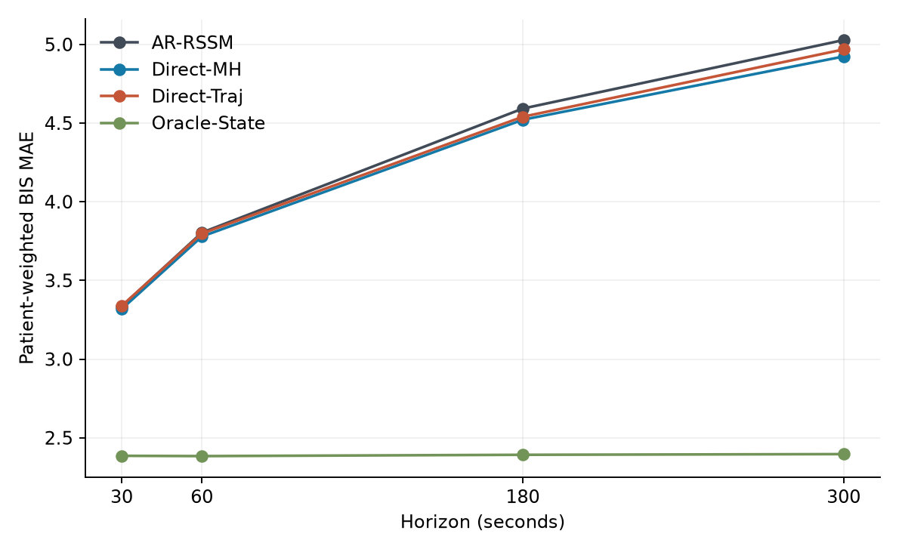
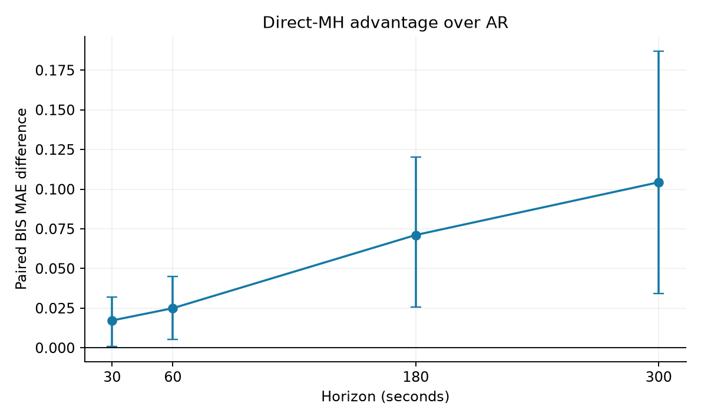
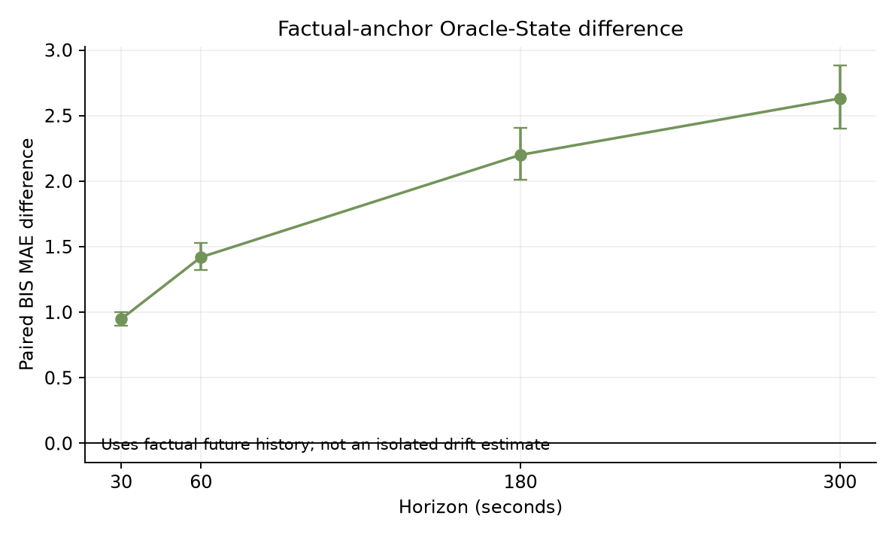
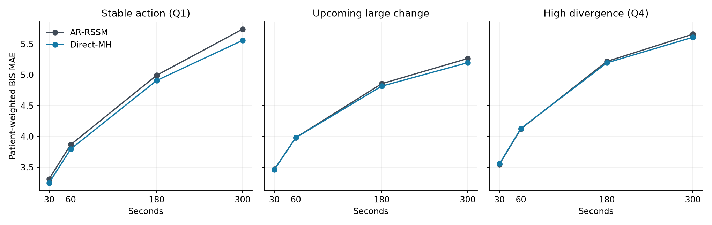
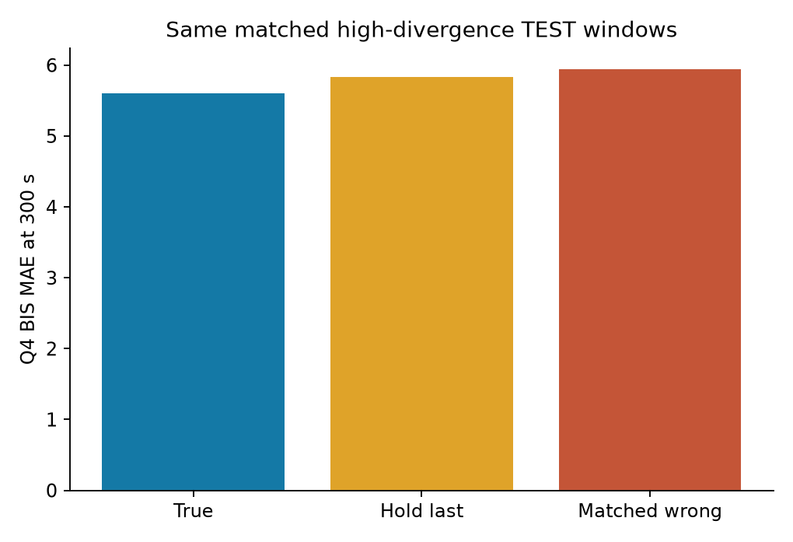
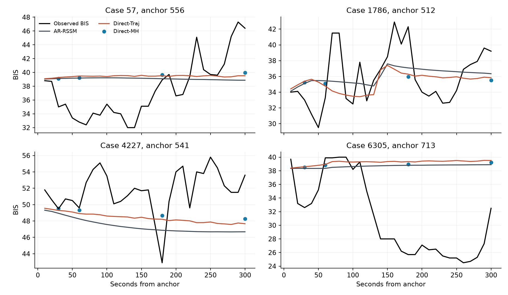

# VitalDB multi-horizon headroom, seed 0

**Outcome B — Direct objective/formulation headroom without isolated recursive drift.**

## Central finding
On 83,198 complete-action TEST windows from 74 patients, the Direct-MH advantage over AR (AR error minus Direct-MH error) rises from 0.017 [0.001, 0.032] at 30 s to 0.104 [0.034, 0.187] at 300 s. The paired change in advantage from 30 to 300 s is 0.087 [0.023, 0.161]. Direct-Traj also gains 0.060 [0.006, 0.117] at 300 s, so endpoint-only supervision does not fully explain the gain.
However, the 300-s Direct-MH gain in Q4 high future-action divergence is 0.050 [-0.055, 0.156] and around upcoming large interventions is 0.068 [-0.013, 0.146]. Neither gives a clear intervention-focused advantage. This limits the case for an intervention-specific multi-horizon method.
Q4 Direct-MH action corruption raises 300-s BIS MAE by 0.235 [0.103, 0.395] when holding the last action, and 0.346 [0.196, 0.502] with a matched wrong future schedule. Thus the direct predictor uses the prospective action sequence.

## Data and design
The unchanged VitalDB numeric cohort has 495 cases and 493 patients. The original case splits are 345/74/76 and subject-disjoint patient splits 345/73/75; 74 test patients have 83,198 complete prospective-action windows. Histories have 180 ten-second steps and futures have 30 steps. BIS and MAP are targets; HR, demographics, historical propofol/remifentanil, missingness masks and observed prospective actions are inherited. Normalization, RATE/VOL preprocessing and exclusions are exactly those of Round 1 and Round 2. No new data were downloaded. Device-computed TCI CE is absent from all model and support features.
AR-RSSM is the unchanged Round-2 seed-0 checkpoint. Re-inferred predictions match its saved 83,198 × 30 × 2 TEST predictions exactly (maximum absolute difference 0). Its latent state at every rollout step is saved in the server-only array cache. Direct-MH and Direct-Traj use the same two-layer 64-dimensional GRU history encoder and a causal 32-dimensional prospective-action GRU. A shared point decoder receives historical latent, action prefix and learned horizon embedding; Direct-MH supervises four endpoints, whereas Direct-Traj supervises all 30. Both decode each point in one forward pass without predicted-state feedback. No auxiliary or representation objective was used.
Both direct models used the original Round-2 epoch window permutations (80,000 windows per epoch), AdamW, standardized BIS MSE + 0.25 MAP MSE, learning rate 0.0005, weight decay 0.0001, 20-epoch maximum, patience five and stride-six validation. Seed 0 was fixed. A separate Direct-NoHorizon run was omitted because it requires another complete training run and is secondary to testing direct versus recursive prediction.

## Model capacity and training
| Model | Parameters | History encoder + norm | Action/predictor/decoder | Best epoch | Best VAL BIS MAE |
|---|---:|---:|---:|---:|---:|
| AR-RSSM | 58,946 | 40,448 | 18,498 | 14 | 3.920 |
| Direct-MH | 51,442 | 40,448 | 10,994 | 13 | 3.799 |
| Direct-Traj | 51,442 | 40,448 | 10,994 | 9 | 3.917 |

FLOPs and latency were not measured; `model_capacity.csv` leaves them blank rather than inventing estimates.

## Primary patient-weighted TEST results
| Model | 30s BIS MAE | 60s | 180s | 300s | Full 5m BIS MAE |
|---|---:|---:|---:|---:|---:|
| AR-RSSM | 3.335 | 3.804 | 4.592 | 5.028 | 4.311 |
| Oracle-State | 2.385 | 2.384 | 2.392 | 2.396 | N/A |
| Direct-MH | 3.318 | 3.779 | 4.521 | 4.923 | N/A |
| Direct-Traj | 3.338 | 3.798 | 4.540 | 4.968 | 4.273 |

| Model | 30s MAP MAE | 60s | 180s | 300s | Full 5m MAP MAE |
|---|---:|---:|---:|---:|---:|
| AR-RSSM | 3.169 | 3.763 | 5.450 | 6.449 | 4.991 |
| Oracle-State | 2.256 | 2.260 | 2.255 | 2.283 | N/A |
| Direct-MH | 3.167 | 3.765 | 5.433 | 6.416 | N/A |
| Direct-Traj | 3.208 | 3.847 | 5.526 | 6.535 | 5.063 |

RMSE at all horizons and full-trajectory BIS/MAP MAE/RMSE are in `horizon_metrics.csv`. The main figure shows BIS; all metrics weight patients equally after averaging eligible windows within each patient. Paired 95% intervals use 1,000 patient-cluster resamples. Windows were never treated as independent patients.

| Comparison (AR error minus comparator) | 30s [95% CI] | 60s | 180s | 300s |
|---|---:|---:|---:|---:|
| DHA | 0.017 [0.001, 0.032] | 0.025 [0.005, 0.045] | 0.071 [0.026, 0.120] | 0.104 [0.034, 0.187] |
| DTA | -0.003 [-0.017, 0.011] | 0.006 [-0.011, 0.022] | 0.052 [0.019, 0.084] | 0.060 [0.006, 0.117] |
| RP | 0.947 [0.895, 1.002] | 1.420 [1.323, 1.527] | 2.200 [2.013, 2.406] | 2.631 [2.399, 2.883] |
| RP_latent_reset | -0.766 [-0.836, -0.695] | -1.055 [-1.138, -0.967] | -1.475 [-1.623, -1.318] | -1.679 [-1.899, -1.444] |

| Model | BIS growth 30→300s | Normalized growth | Slope vs log(seconds) |
|---|---:|---:|---:|
| AR-RSSM | 1.692 | 0.507 | 0.730 |
| Oracle-State | 0.011 | 0.005 | 0.005 |
| Direct-MH | 1.605 | 0.484 | 0.692 |
| Direct-Traj | 1.630 | 0.488 | 0.701 |

The slope is an unadjusted four-point descriptive fit against natural log horizon in seconds. `error_growth.csv` also reports MAP and subgroup growth; `headroom_trends.csv` reports paired change in DHA, DTA and oracle differences with bootstrap intervals.

## Oracle-State interpretation
The local factual-anchor Oracle-State comparison gives RP(300 s) = 2.631 [2.399, 2.883]. It uses the true BIS/MAP at t+290 s as the model residual baseline and encodes the real history ending there. This has a major information advantage over a deployable t-origin prediction, so a growing raw RP cannot isolate recursive latent drift. The additional Oracle-Latent-Reset keeps the original t-origin residual baseline while replacing only the latent with the factual later-anchor encoding. Its 300-s difference is -1.679 [-1.899, -1.444]: factual latent reset does not improve the free rollout under a fixed baseline. This reset also creates a state/baseline pairing that was never trained, so its negative result cannot prove the absence of drift. Together the audits do not isolate a recursive-drift mechanism.
Each oracle input ends at t+h−1; its one local transition receives only action t+h. No physiological value at t+h or later action enters that input. An automated mutation test confirms that changing the target-time physiology or later action leaves the oracle input unchanged. The oracle is diagnostic and is excluded from claims of deployable forecast performance.

## Intervention subgroups and action dependence
| Subgroup | AR 300s MAE | Direct-MH 300s MAE | DHA [95% CI] | Patients |
|---|---:|---:|---:|---:|
| overall | 5.028 | 4.923 | 0.104 [0.034, 0.187] | 74 |
| Q4 | 5.660 | 5.610 | 0.050 [-0.055, 0.156] | 74 |
| upcoming_large_intervention | 5.264 | 5.197 | 0.068 [-0.013, 0.146] | 74 |
| stable_action_Q1 | 5.741 | 5.559 | 0.182 [-0.068, 0.459] | 74 |
| initiation | 5.281 | 5.091 | 0.190 [0.014, 0.370] | 71 |
| increase | 5.589 | 5.386 | 0.203 [-0.017, 0.433] | 67 |
| decrease | 5.061 | 4.996 | 0.066 [-0.013, 0.143] | 74 |
| stop | 6.775 | 7.207 | -0.432 [-1.268, 0.311] | 35 |
| high_rate_tail | 5.740 | 5.680 | 0.060 [-0.071, 0.184] | 73 |
| non_tail | 4.865 | 4.747 | 0.118 [0.038, 0.212] | 74 |

Initiation/increase/decrease/stop and upcoming-large labels reuse the Round-2 action-only event definitions. Q4 and stable Q1 use Round-2 TRAIN-defined divergence cutoffs. Tail/non-tail use its TRAIN 99th-percentile positive-rate caps; these are exploratory because that sensitivity analysis was added after Round-2 inspection. The stop subgroup has only 35 patients and a wide interval. Matched wrong-action swaps use the original Round-2 donor mapping from other TEST patients and are assessed only where a donor exists. `action_sensitivity_metrics.csv` gives both direct models, all horizons, BIS/MAP, hold and matched wrong actions.

## Figures

The trajectory figure uses cases at fixed quartile positions of sorted TEST case IDs and each case’s median eligible anchor; no model error informed display-window selection.

## Scientific decision and limitations
This experiment finds a small but increasing direct-prediction benefit, including a full-trajectory direct control, with retained prospective-action sensitivity. It does not demonstrate a recursive latent-drift mechanism, and the long-horizon gain is not clearly amplified in Q4 or upcoming intervention changes. Outcome B is the closest of the four requested categories, with an important qualification: the original AR-RSSM was itself trained against the full 30-step trajectory, so these results do not establish a one-step-objective mismatch. The raw Oracle-State and AR errors are not similar because the oracle receives factual future physiology. Direct model structure, action encoding and optimization remain alternative explanations. The evidence is insufficient to frame a final model as fixing recursive rollout drift or to claim intervention-specific benefit.

This is one architecture, one seed for the new direct models, one split and a five-minute observational horizon. Parameter counts are close but the direct causal action encoder differs from the RSSM GRUCell, so an architectural contribution cannot be excluded. Shared validation checkpoint selection and direct-model optimization can also affect small differences. Oracle-State uses future factual physiology and must not be presented as deployable. These data do not establish treatment counterfactual accuracy or clinical safety.
