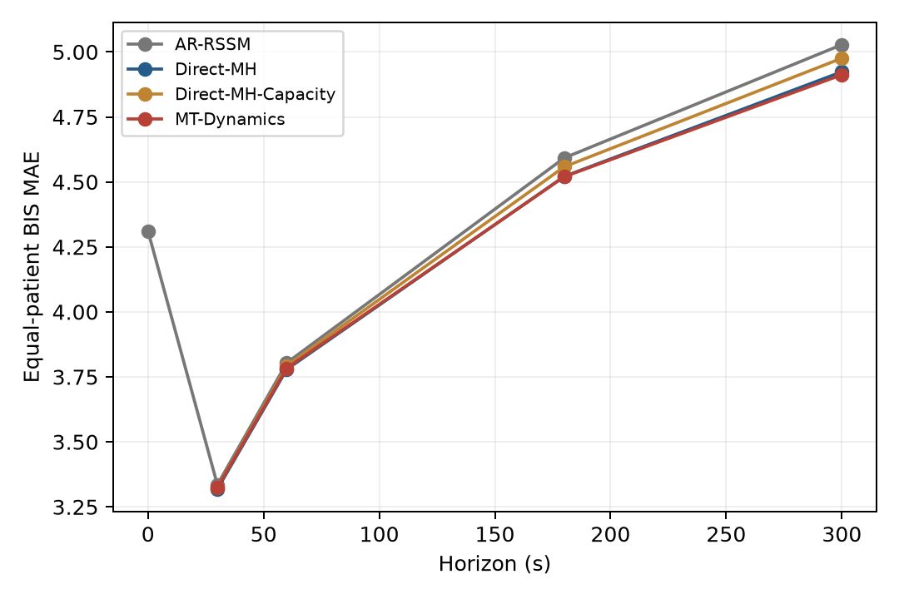
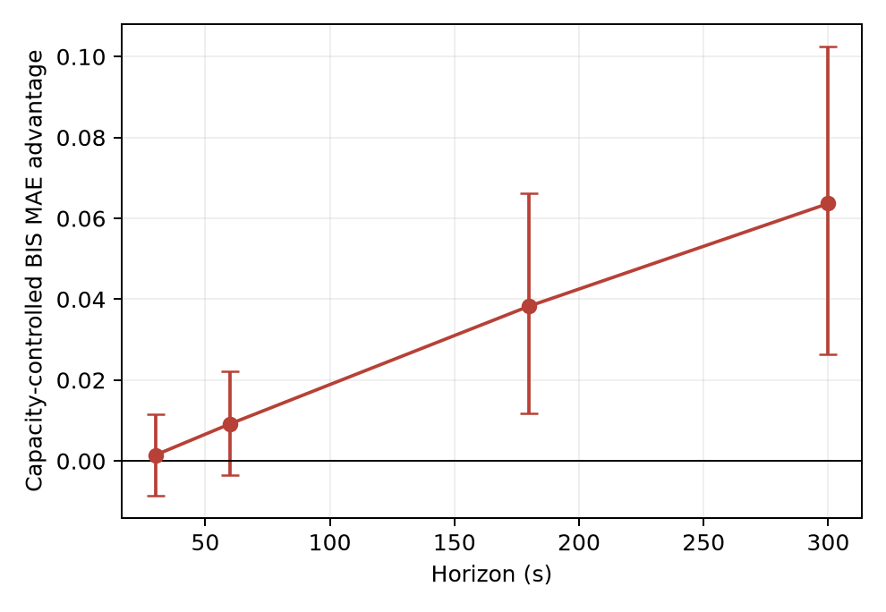
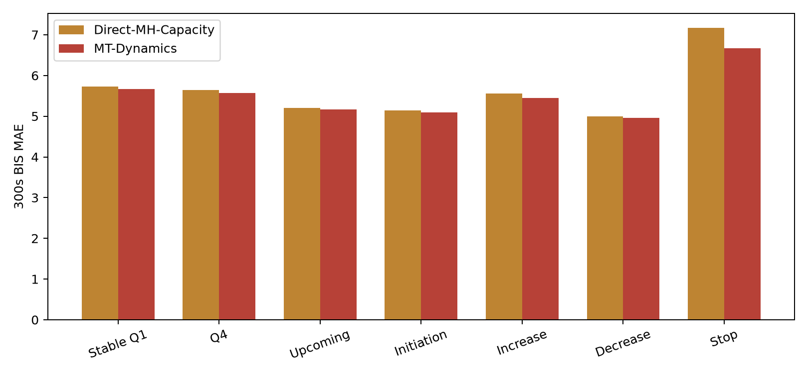
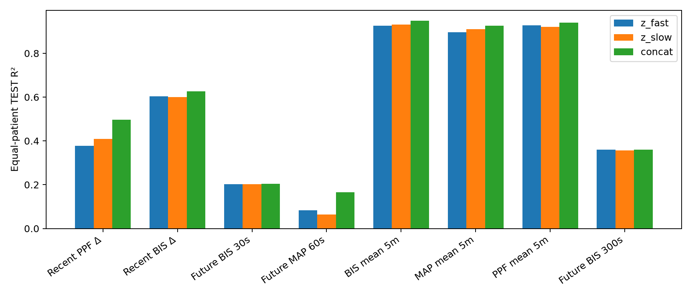
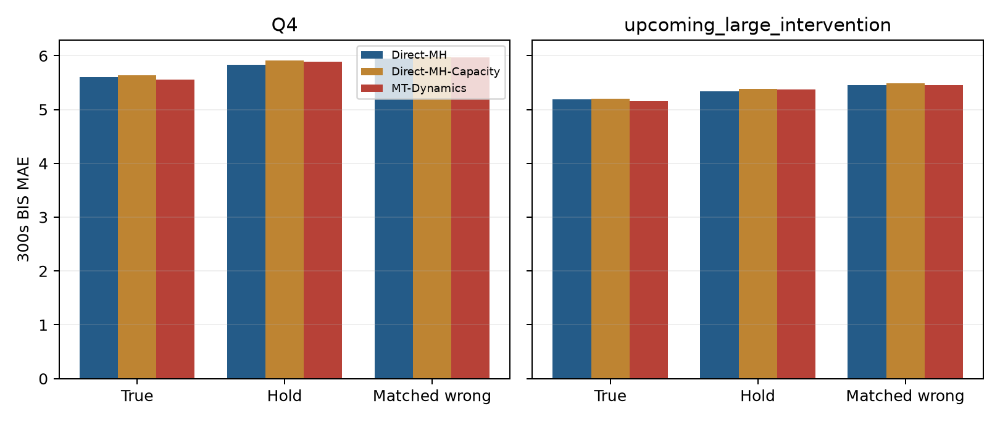
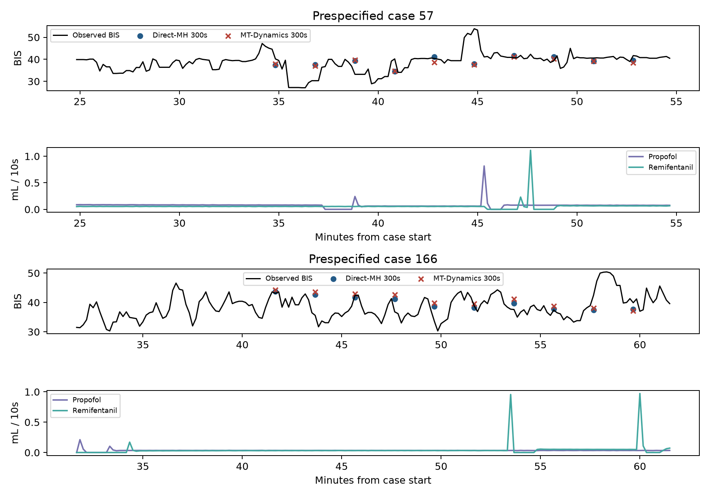

Decision: CONDITIONAL
A positive capacity-controlled long-horizon effect survived patient bootstrap, but the practical benefit was modest.

Outcome B. One seed, one VitalDB cohort; no causal effect claim.

## Cohort and controlled design
495 cases / 493 patients; patient-disjoint splits {'train': 345, 'val': 74, 'test': 76}, effective TEST 74 patients and 83198 windows. 10-second sampling, 180-step history, 30-step future; all models use the same four endpoints and 80,000-window epoch permutations.
The unchanged Round-1 numeric tracks, normalization, masks, demographics, RATE/VOL rules and observed prospective future actions are inherited. CE and waveforms are excluded from training. Direct-MH was reused from its original checkpoint and its TEST predictions matched to numerical tolerance. Fast transitions run 30 times and slow transitions 5 times per 300s rollout. The slow update consumes only its completed six-action block and current fast state.
## Parameter and compute accounting
| model | parameters | training_parameters | deployment_parameters | train_seconds | peak_vram_mib |
|---|---|---|---|---|---|
| AR-RSSM | 58946 | 58946 | 58946 | 275.017 | nan |
| Direct-MH | 51442 | 51442 | 51442 | 128.969 | nan |
| Direct-MH-Capacity | 63619 | 63619 | 63619 | 143.935 | 486.999 |
| MT-Dynamics | 64114 | 64114 | 64114 | 244.536 | 430.374 |
Reference Direct-MH and AR peak VRAM were not recorded in their original runs (NA).
## Primary TEST BIS results
| model | horizon_seconds | mae | rmse | patients |
|---|---|---|---|---|
| Direct-MH | 30 | 3.318 | 4.475 | 74 |
| Direct-MH | 60 | 3.779 | 5.095 | 74 |
| Direct-MH | 180 | 4.521 | 6.173 | 74 |
| Direct-MH | 300 | 4.923 | 6.824 | 74 |
| Direct-MH-Capacity | 30 | 3.325 | 4.482 | 74 |
| Direct-MH-Capacity | 60 | 3.793 | 5.107 | 74 |
| Direct-MH-Capacity | 180 | 4.558 | 6.220 | 74 |
| Direct-MH-Capacity | 300 | 4.976 | 6.889 | 74 |
| MT-Dynamics | 30 | 3.324 | 4.485 | 74 |
| MT-Dynamics | 60 | 3.784 | 5.100 | 74 |
| MT-Dynamics | 180 | 4.520 | 6.159 | 74 |
| MT-Dynamics | 300 | 4.912 | 6.788 | 74 |

## Secondary TEST MAP results
| model | horizon_seconds | mae | rmse | patients |
|---|---|---|---|---|
| Direct-MH | 30 | 3.167 | 8.018 | 56 |
| Direct-MH | 60 | 3.765 | 8.616 | 56 |
| Direct-MH | 180 | 5.433 | 9.830 | 56 |
| Direct-MH | 300 | 6.416 | 10.687 | 56 |
| Direct-MH-Capacity | 30 | 3.169 | 8.007 | 56 |
| Direct-MH-Capacity | 60 | 3.770 | 8.617 | 56 |
| Direct-MH-Capacity | 180 | 5.415 | 9.803 | 56 |
| Direct-MH-Capacity | 300 | 6.418 | 10.672 | 56 |
| MT-Dynamics | 30 | 3.167 | 8.001 | 56 |
| MT-Dynamics | 60 | 3.764 | 8.606 | 56 |
| MT-Dynamics | 180 | 5.513 | 9.878 | 56 |
| MT-Dynamics | 300 | 6.541 | 10.768 | 56 |

## Paired patient-cluster comparisons
Positive MTA/CCA means MT-Dynamics lowers error. LongShortGain is CCA(300s) minus CCA(30s). CIs use 1,000 resamples of patients.
| comparison | horizon_seconds | difference_mae | ci_low | ci_high | patients | windows |
|---|---|---|---|---|---|---|
| MTA | 30 | -0.006 | -0.017 | 0.007 | 74 | 83198 |
| CCA | 30 | 0.001 | -0.009 | 0.012 | 74 | 83198 |
| MTA | 60 | -0.004 | -0.022 | 0.015 | 74 | 83198 |
| CCA | 60 | 0.009 | -0.004 | 0.022 | 74 | 83198 |
| MTA | 180 | 0.001 | -0.036 | 0.050 | 74 | 83198 |
| CCA | 180 | 0.038 | 0.012 | 0.066 | 74 | 83198 |
| MTA | 300 | 0.011 | -0.037 | 0.065 | 74 | 83198 |
| CCA | 300 | 0.064 | 0.026 | 0.102 | 74 | 83198 |
| LongShortGain | 300 | 0.062 | 0.024 | 0.102 | 74 | 83198 |
## Intervention-event and action audit
Paired 300s capacity-controlled event comparisons (patient-bootstrap 95% CI):
| subset | difference_mae | ci_low | ci_high | patients | windows |
|---|---|---|---|---|---|
| stable_action_Q1 | 0.058 | -0.108 | 0.215 | 74 | 21772 |
| Q4 | 0.071 | -0.010 | 0.162 | 74 | 20995 |
| upcoming_large_intervention | 0.041 | -0.029 | 0.115 | 74 | 26939 |
| initiation | 0.042 | -0.125 | 0.198 | 71 | 4390 |
| increase | 0.121 | -0.022 | 0.283 | 67 | 3785 |
| decrease | 0.031 | -0.046 | 0.112 | 74 | 18081 |
| stop | 0.501 | 0.016 | 1.154 | 35 | 683 |
| model | subset | horizon_seconds | mae | patients | windows |
|---|---|---|---|---|---|
| Direct-MH | stable_action_Q1 | 60 | 3.794 | 74 | 21772 |
| Direct-MH | stable_action_Q1 | 180 | 4.908 | 74 | 21772 |
| Direct-MH | stable_action_Q1 | 300 | 5.559 | 74 | 21772 |
| Direct-MH-Capacity | stable_action_Q1 | 60 | 3.851 | 74 | 21772 |
| Direct-MH-Capacity | stable_action_Q1 | 180 | 5.018 | 74 | 21772 |
| Direct-MH-Capacity | stable_action_Q1 | 300 | 5.723 | 74 | 21772 |
| MT-Dynamics | stable_action_Q1 | 60 | 3.817 | 74 | 21772 |
| MT-Dynamics | stable_action_Q1 | 180 | 4.927 | 74 | 21772 |
| MT-Dynamics | stable_action_Q1 | 300 | 5.666 | 74 | 21772 |
| Direct-MH | Q4 | 60 | 4.131 | 74 | 20995 |
| Direct-MH | Q4 | 180 | 5.195 | 74 | 20995 |
| Direct-MH | Q4 | 300 | 5.610 | 74 | 20995 |
| Direct-MH-Capacity | Q4 | 60 | 4.120 | 74 | 20995 |
| Direct-MH-Capacity | Q4 | 180 | 5.200 | 74 | 20995 |
| Direct-MH-Capacity | Q4 | 300 | 5.642 | 74 | 20995 |
| MT-Dynamics | Q4 | 60 | 4.152 | 74 | 20995 |
| MT-Dynamics | Q4 | 180 | 5.186 | 74 | 20995 |
| MT-Dynamics | Q4 | 300 | 5.571 | 74 | 20995 |
| Direct-MH | upcoming_large_intervention | 60 | 3.980 | 74 | 26939 |
| Direct-MH | upcoming_large_intervention | 180 | 4.817 | 74 | 26939 |
| Direct-MH | upcoming_large_intervention | 300 | 5.197 | 74 | 26939 |
| Direct-MH-Capacity | upcoming_large_intervention | 60 | 3.981 | 74 | 26939 |
| Direct-MH-Capacity | upcoming_large_intervention | 180 | 4.826 | 74 | 26939 |
| Direct-MH-Capacity | upcoming_large_intervention | 300 | 5.205 | 74 | 26939 |
| MT-Dynamics | upcoming_large_intervention | 60 | 3.984 | 74 | 26939 |
| MT-Dynamics | upcoming_large_intervention | 180 | 4.799 | 74 | 26939 |
| MT-Dynamics | upcoming_large_intervention | 300 | 5.163 | 74 | 26939 |
| Direct-MH | high_rate_tail | 60 | 4.276 | 73 | 17059 |
| Direct-MH | high_rate_tail | 180 | 5.327 | 73 | 17059 |
| Direct-MH | high_rate_tail | 300 | 5.680 | 73 | 17059 |
| Direct-MH-Capacity | high_rate_tail | 60 | 4.257 | 73 | 17059 |
| Direct-MH-Capacity | high_rate_tail | 180 | 5.328 | 73 | 17059 |
| Direct-MH-Capacity | high_rate_tail | 300 | 5.705 | 73 | 17059 |
| MT-Dynamics | high_rate_tail | 60 | 4.289 | 73 | 17059 |
| MT-Dynamics | high_rate_tail | 180 | 5.315 | 73 | 17059 |
| MT-Dynamics | high_rate_tail | 300 | 5.651 | 73 | 17059 |
| Direct-MH | non_tail | 60 | 3.643 | 74 | 66139 |
| Direct-MH | non_tail | 180 | 4.295 | 74 | 66139 |
| Direct-MH | non_tail | 300 | 4.747 | 74 | 66139 |
| Direct-MH-Capacity | non_tail | 60 | 3.669 | 74 | 66139 |
| Direct-MH-Capacity | non_tail | 180 | 4.346 | 74 | 66139 |
| Direct-MH-Capacity | non_tail | 300 | 4.802 | 74 | 66139 |
| MT-Dynamics | non_tail | 60 | 3.647 | 74 | 66139 |
| MT-Dynamics | non_tail | 180 | 4.305 | 74 | 66139 |
| MT-Dynamics | non_tail | 300 | 4.755 | 74 | 66139 |
| Direct-MH | initiation | 60 | 4.055 | 71 | 4390 |
| Direct-MH | initiation | 180 | 4.840 | 71 | 4390 |
| Direct-MH | initiation | 300 | 5.091 | 71 | 4390 |
| Direct-MH-Capacity | initiation | 60 | 4.188 | 71 | 4390 |
| Direct-MH-Capacity | initiation | 180 | 4.907 | 71 | 4390 |
| Direct-MH-Capacity | initiation | 300 | 5.140 | 71 | 4390 |
| MT-Dynamics | initiation | 60 | 4.118 | 71 | 4390 |
| MT-Dynamics | initiation | 180 | 4.875 | 71 | 4390 |
| MT-Dynamics | initiation | 300 | 5.097 | 71 | 4390 |
| Direct-MH | increase | 60 | 4.313 | 67 | 3785 |
| Direct-MH | increase | 180 | 5.037 | 67 | 3785 |
| Direct-MH | increase | 300 | 5.386 | 67 | 3785 |
| Direct-MH-Capacity | increase | 60 | 4.263 | 67 | 3785 |
| Direct-MH-Capacity | increase | 180 | 5.218 | 67 | 3785 |
| Direct-MH-Capacity | increase | 300 | 5.563 | 67 | 3785 |
| MT-Dynamics | increase | 60 | 4.275 | 67 | 3785 |
| MT-Dynamics | increase | 180 | 5.102 | 67 | 3785 |
| MT-Dynamics | increase | 300 | 5.442 | 67 | 3785 |
| Direct-MH | decrease | 60 | 3.915 | 74 | 18081 |
| Direct-MH | decrease | 180 | 4.715 | 74 | 18081 |
| Direct-MH | decrease | 300 | 4.996 | 74 | 18081 |
| Direct-MH-Capacity | decrease | 60 | 3.891 | 74 | 18081 |
| Direct-MH-Capacity | decrease | 180 | 4.692 | 74 | 18081 |
| Direct-MH-Capacity | decrease | 300 | 4.994 | 74 | 18081 |
| MT-Dynamics | decrease | 60 | 3.904 | 74 | 18081 |
| MT-Dynamics | decrease | 180 | 4.682 | 74 | 18081 |
| MT-Dynamics | decrease | 300 | 4.963 | 74 | 18081 |
| Direct-MH | stop | 60 | 4.170 | 35 | 683 |
| Direct-MH | stop | 180 | 4.930 | 35 | 683 |
| Direct-MH | stop | 300 | 7.207 | 35 | 683 |
| Direct-MH-Capacity | stop | 60 | 4.357 | 35 | 683 |
| Direct-MH-Capacity | stop | 180 | 5.229 | 35 | 683 |
| Direct-MH-Capacity | stop | 300 | 7.166 | 35 | 683 |
| MT-Dynamics | stop | 60 | 4.229 | 35 | 683 |
| MT-Dynamics | stop | 180 | 4.826 | 35 | 683 |
| MT-Dynamics | stop | 300 | 6.666 | 35 | 683 |
| model | condition | subset | mae | patients | windows |
|---|---|---|---|---|---|
| Direct-MH | true | Q4 | 5.598 | 74 | 20642 |
| Direct-MH | hold | Q4 | 5.832 | 74 | 20642 |
| Direct-MH | wrong | Q4 | 5.944 | 74 | 20642 |
| Direct-MH | true | upcoming_large_intervention | 5.188 | 74 | 26466 |
| Direct-MH | hold | upcoming_large_intervention | 5.342 | 74 | 26466 |
| Direct-MH | wrong | upcoming_large_intervention | 5.451 | 74 | 26466 |
| Direct-MH | true | initiation | 5.074 | 71 | 4276 |
| Direct-MH | hold | initiation | 5.414 | 71 | 4276 |
| Direct-MH | wrong | initiation | 5.477 | 71 | 4276 |
| Direct-MH | true | increase | 5.359 | 67 | 3695 |
| Direct-MH | hold | increase | 5.687 | 67 | 3695 |
| Direct-MH | wrong | increase | 5.760 | 67 | 3695 |
| Direct-MH-Capacity | true | Q4 | 5.634 | 74 | 20642 |
| Direct-MH-Capacity | hold | Q4 | 5.909 | 74 | 20642 |
| Direct-MH-Capacity | wrong | Q4 | 5.987 | 74 | 20642 |
| Direct-MH-Capacity | true | upcoming_large_intervention | 5.198 | 74 | 26466 |
| Direct-MH-Capacity | hold | upcoming_large_intervention | 5.381 | 74 | 26466 |
| Direct-MH-Capacity | wrong | upcoming_large_intervention | 5.487 | 74 | 26466 |
| Direct-MH-Capacity | true | initiation | 5.124 | 71 | 4276 |
| Direct-MH-Capacity | hold | initiation | 5.490 | 71 | 4276 |
| Direct-MH-Capacity | wrong | initiation | 5.550 | 71 | 4276 |
| Direct-MH-Capacity | true | increase | 5.559 | 67 | 3695 |
| Direct-MH-Capacity | hold | increase | 5.858 | 67 | 3695 |
| Direct-MH-Capacity | wrong | increase | 5.879 | 67 | 3695 |
| MT-Dynamics | true | Q4 | 5.561 | 74 | 20642 |
| MT-Dynamics | hold | Q4 | 5.893 | 74 | 20642 |
| MT-Dynamics | wrong | Q4 | 5.967 | 74 | 20642 |
| MT-Dynamics | true | upcoming_large_intervention | 5.155 | 74 | 26466 |
| MT-Dynamics | hold | upcoming_large_intervention | 5.370 | 74 | 26466 |
| MT-Dynamics | wrong | upcoming_large_intervention | 5.458 | 74 | 26466 |
| MT-Dynamics | true | initiation | 5.072 | 71 | 4276 |
| MT-Dynamics | hold | initiation | 5.598 | 71 | 4276 |
| MT-Dynamics | wrong | initiation | 5.518 | 71 | 4276 |
| MT-Dynamics | true | increase | 5.430 | 67 | 3695 |
| MT-Dynamics | hold | increase | 5.713 | 67 | 3695 |
| MT-Dynamics | wrong | increase | 5.757 | 67 | 3695 |
The true, hold, and wrong action rows use identical donor-eligible windows within each subset.
## Frozen branch probes
| representation | target | r2 | r2_ci_low | r2_ci_high | patients |
|---|---|---|---|---|---|
| z_fast | future_delta_BIS_30s | 0.202 | 0.182 | 0.220 | 74 |
| z_slow | future_delta_BIS_30s | 0.202 | 0.182 | 0.220 | 74 |
| concat | future_delta_BIS_30s | 0.204 | 0.183 | 0.222 | 74 |
| z_fast | future_delta_BIS_60s | 0.252 | 0.231 | 0.272 | 74 |
| z_slow | future_delta_BIS_60s | 0.250 | 0.230 | 0.269 | 74 |
| concat | future_delta_BIS_60s | 0.254 | 0.233 | 0.274 | 74 |
| z_fast | future_delta_BIS_180s | 0.331 | 0.310 | 0.349 | 74 |
| z_slow | future_delta_BIS_180s | 0.327 | 0.307 | 0.344 | 74 |
| concat | future_delta_BIS_180s | 0.333 | 0.312 | 0.353 | 74 |
| z_fast | future_delta_BIS_300s | 0.359 | 0.329 | 0.387 | 74 |
| z_slow | future_delta_BIS_300s | 0.356 | 0.323 | 0.386 | 74 |
| concat | future_delta_BIS_300s | 0.361 | 0.325 | 0.392 | 74 |
| z_fast | future_delta_MAP_30s | 0.077 | 0.049 | 0.093 | 74 |
| z_slow | future_delta_MAP_30s | 0.059 | 0.037 | 0.072 | 74 |
| concat | future_delta_MAP_30s | 0.161 | 0.118 | 0.186 | 74 |
| z_fast | future_delta_MAP_60s | 0.083 | 0.051 | 0.103 | 74 |
| z_slow | future_delta_MAP_60s | 0.064 | 0.038 | 0.081 | 74 |
| concat | future_delta_MAP_60s | 0.166 | 0.117 | 0.196 | 74 |
| z_fast | future_delta_MAP_180s | 0.084 | 0.050 | 0.106 | 74 |
| z_slow | future_delta_MAP_180s | 0.064 | 0.035 | 0.084 | 74 |
| concat | future_delta_MAP_180s | 0.158 | 0.109 | 0.189 | 74 |
| z_fast | future_delta_MAP_300s | 0.083 | 0.047 | 0.106 | 74 |
| z_slow | future_delta_MAP_300s | 0.068 | 0.038 | 0.090 | 74 |
| concat | future_delta_MAP_300s | 0.144 | 0.101 | 0.175 | 74 |
| z_fast | recent_BIS_delta_300s | 0.604 | 0.586 | 0.624 | 74 |
| z_slow | recent_BIS_delta_300s | 0.601 | 0.583 | 0.619 | 74 |
| concat | recent_BIS_delta_300s | 0.627 | 0.606 | 0.648 | 74 |
| z_fast | history_BIS_mean_300s | 0.926 | 0.909 | 0.938 | 74 |
| z_slow | history_BIS_mean_300s | 0.932 | 0.919 | 0.942 | 74 |
| concat | history_BIS_mean_300s | 0.949 | 0.937 | 0.957 | 74 |
| z_fast | history_MAP_mean_300s | 0.896 | 0.876 | 0.912 | 74 |
| z_slow | history_MAP_mean_300s | 0.911 | 0.894 | 0.925 | 74 |
| concat | history_MAP_mean_300s | 0.926 | 0.912 | 0.938 | 74 |
| z_fast | recent_PPF_action_delta_300s | 0.377 | 0.361 | 0.392 | 74 |
| z_slow | recent_PPF_action_delta_300s | 0.410 | 0.396 | 0.424 | 74 |
| concat | recent_PPF_action_delta_300s | 0.497 | 0.485 | 0.508 | 74 |
| z_fast | recent_RFTN_action_delta_300s | 0.287 | 0.267 | 0.305 | 74 |
| z_slow | recent_RFTN_action_delta_300s | 0.311 | 0.286 | 0.332 | 74 |
| concat | recent_RFTN_action_delta_300s | 0.456 | 0.440 | 0.469 | 74 |
| z_fast | history_PPF_action_mean_300s | 0.928 | 0.911 | 0.940 | 74 |
| z_slow | history_PPF_action_mean_300s | 0.920 | 0.900 | 0.934 | 74 |
| concat | history_PPF_action_mean_300s | 0.939 | 0.922 | 0.951 | 74 |
| z_fast | history_RFTN_action_mean_300s | 0.884 | 0.861 | 0.901 | 74 |
| z_slow | history_RFTN_action_mean_300s | 0.879 | 0.855 | 0.898 | 74 |
| concat | history_RFTN_action_mean_300s | 0.920 | 0.900 | 0.934 | 74 |
Recent action/physiology summaries come only from historical samples; future-change labels are used solely in frozen-model probes. The initial latent states cannot see future actions, so these probes should not be treated as full intervention-response capability.
## Conditional ablations
Ablation gate met: False. No ablation checkpoints were trained because the primary result did not satisfy that gate.
## Eight research questions
1. Beyond Direct-MH? No convincing gain: 300s MTA=0.011 [-0.037, 0.065] BIS MAE; the interval crosses zero.
2. Beyond capacity control? Yes statistically, but modest: 300s CCA=0.064 [0.026, 0.102], about 1.3% of control error.
3. Growing with horizon? LongShortGain=0.062 [0.024, 0.102].
4. Intervention changes? Mixed, and no robust improvement over the original Direct-MH: 300s capacity-controlled advantages for Q4, upcoming, initiation, increase are Q4 0.071, upcoming_large_intervention 0.041, initiation 0.042, increase 0.121.
5. Action sensitivity? Preserved in the matched-donor Q4 and upcoming-change 300s checks; full true/hold/wrong table is below.
6. Branch specialization? Fast won 0/5 prespecified short probes and slow won 0/6 prespecified long probes by >0.03 R²; this is insufficient evidence of specialization. Probe interpretation is descriptive.
7. Same-rate two-branch? Not run because the primary capacity-controlled benefit did not meet the predeclared ablation gate; this comparison remains unresolved and cannot be used as positive evidence.
8. Decision: CONDITIONAL, Outcome B.

## Figures

## Interpretation
The predeclared rule assigns Outcome B / CONDITIONAL because the capacity-controlled 300s difference and its horizon gradient have patient-bootstrap intervals above zero. This does not establish that distinct update rates caused the gain: the same-rate two-branch ablation was gated off, frozen probes showed no predicted fast/slow specialization, and the original Direct-MH is effectively tied with MT-Dynamics. The 0.064 BIS MAE capacity-controlled difference is small relative to about 5 BIS MAE absolute error; MT-Dynamics also took more training time. This is insufficient to build a publication claim or scale the architecture now.
## Limits
A single seed and one observational dataset cannot establish broad architectural generality. Prospective schedules are observed factual actions; matched wrong schedules are input perturbations, not treatment counterfactuals. Highly overlapping windows are handled by patient-clustered uncertainty, but effective independent sample size is limited.
