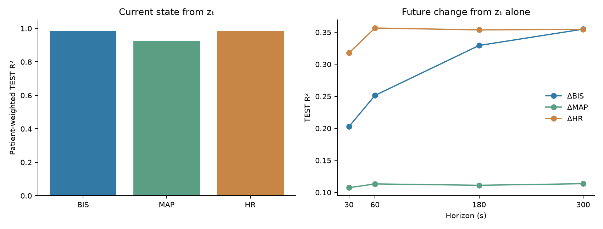
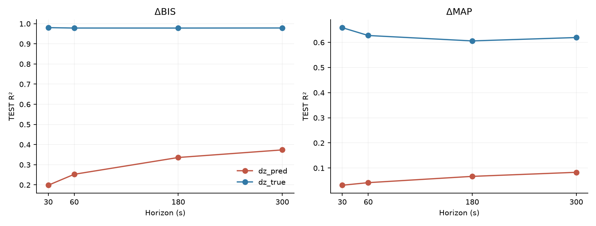
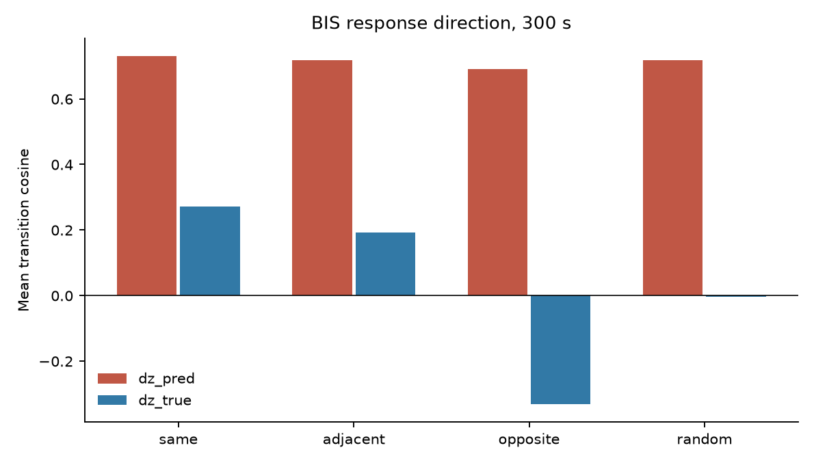
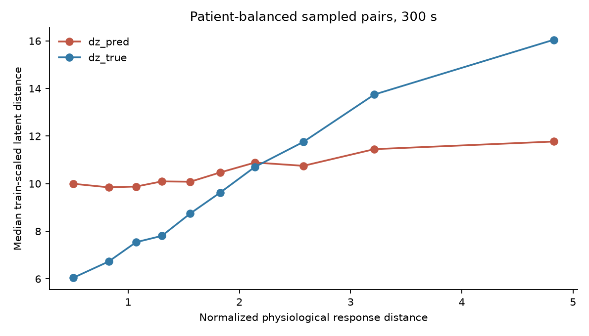
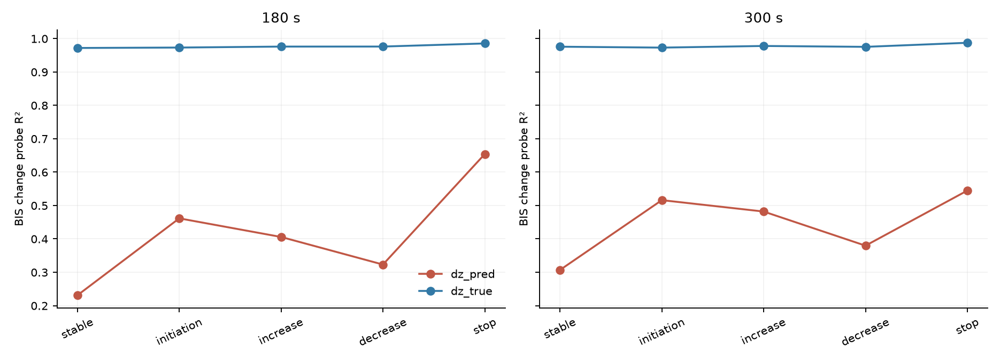
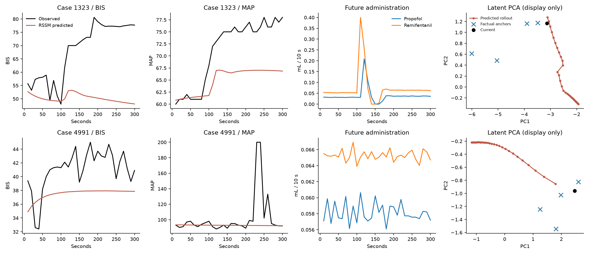

# VitalDB physiological grounding audit, seed 0

**Outcome A — Physiological transition-geometry gap (qualified).**

## Central finding
The frozen prospective RSSM still reproduces the prior 83,198-window TEST forecast exactly (maximum absolute difference 0.0). Its current latent linearly recovers BIS/MAP/HR with patient-weighted R² 0.986 / 0.924 / 0.983. At 300 s, a linear probe on predicted latent displacement recovers the respective physiological changes with R² 0.374 / 0.083 / 0.356, while a probe on factual-anchor displacement reaches 0.979 / 0.619 / 0.976. The small MLP on predicted displacement reaches 0.382 / 0.126 / 0.386; nonlinear decoding does not remove the main gap.
At 300 s, predicted-displacement BIS same-minus-opposite response-direction cosine is 0.040 [0.029, 0.052], versus 0.603 [0.579, 0.629] for factual displacement. Patient-balanced triplet ordering accuracy is 0.543 versus 0.718; their paired predicted-minus-factual difference is -0.175 [-0.195, -0.154] across 56 patients with complete BIS/MAP/HR changes.

**Interpretation boundary.** Factual-anchor `z_true(t+h)` encodes the actual physiology at the endpoint. Its high ΔBIS/ΔHR probe score is partly expected from endpoint information and cannot establish that the transition model drifts from a causal physiological manifold. The weak predicted-displacement direction and response-order tests are a separate geometric observation. The predicted BIS probe improves rather than deteriorates from 30 to 300 s, and Q4 intervention-change windows are not disproportionately worse than stable-action windows. These facts limit the strong horizon-decay and intervention-specific claims.

## Unchanged cohort, model and leakage policy
The numeric VitalDB cohort contains 495 cases and 493 patients, with unchanged 345/74/76 case and 345/73/75 disjoint-subject TRAIN/VAL/TEST splits. Complete prospective-action windows number 370,566/79,574/83,198; 74 TEST patients are evaluable. The original 10-second, 180-step history/30-step future, preprocessing, normalization, missingness masks, demographics and propofol/remifentanil administration are reused. No data were downloaded.
The seed-0 58,946-parameter prospective-action RSSM checkpoint is frozen. For every eligible TRAIN/VAL/TEST window the cache stores z_t, all 30 predicted rollout latents, BIS/MAP predictions, and factual-anchor encodings at 30/60/180/300 s. Factual histories end at t+h and therefore include the observed endpoint but nothing later. Mutation checks show that changing data after the endpoint cannot change the factual input; changing endpoint physiology does change it. The large latent cache remains on the compute server and is excluded from Git.
Ridge probes are fit only on TRAIN windows; regularization is selected from 0.1/10/1000 by VAL patient-weighted R². No TEST outcome chooses alpha. A 64→32→3 MLP is trained on at most 60,000 TRAIN windows per horizon/representation with VAL-only early stopping; no RSSM parameter is updated. Every reported TEST metric weights patients equally, and central intervals use 1,000 patient-cluster resamples. Overlapping windows do not count as independent patients.

## Current state and future-change probes
| Representation | Target | TEST R² | MAE | Pearson |
|---|---|---:|---:|---:|
| z_t | BIS_t | 0.986 | 0.800 | 0.993 |
| demographics | BIS_t | -0.022 | 7.250 | 0.043 |
| drug_history | BIS_t | 0.034 | 7.177 | 0.239 |
| raw_other_current | BIS_t | 0.006 | 7.194 | 0.164 |
| random_latent | BIS_t | -0.020 | 7.218 | 0.001 |
| z_t | MAP_t | 0.924 | 2.828 | 0.962 |
| demographics | MAP_t | -0.026 | 12.962 | -0.040 |
| drug_history | MAP_t | 0.020 | 12.850 | 0.158 |
| raw_other_current | MAP_t | 0.008 | 12.770 | 0.113 |
| random_latent | MAP_t | -0.004 | 12.990 | 0.000 |
| z_t | HR_t | 0.983 | 1.292 | 0.991 |
| demographics | HR_t | -0.088 | 11.250 | -0.073 |
| drug_history | HR_t | 0.060 | 10.212 | 0.262 |
| raw_other_current | HR_t | -0.077 | 11.232 | -0.016 |
| random_latent | HR_t | -0.008 | 10.731 | 0.002 |

The raw-current control excludes the predicted variable from current value, trailing means, trailing SD and change; demographics remain. The random Gaussian representation is 64-dimensional, matching z_t. Current-state decodability is a sanity check. The original model receives historical state and its decoder adds the current BIS/MAP as a residual baseline, so current-state decodability alone is not a transition-grounding result.

| Future ΔBIS representation | 30s R² | 60s | 180s | 300s |
|---|---:|---:|---:|---:|
| z_t | 0.203 | 0.251 | 0.329 | 0.355 |
| action | 0.001 | 0.004 | 0.029 | 0.065 |
| z_t+action | 0.205 | 0.257 | 0.335 | 0.363 |
| raw_history+action | 0.160 | 0.184 | 0.229 | 0.270 |

`future_change_probe_metrics.csv` gives the corresponding MAP and HR results. Future action summaries contain only dose information from t+1 through the evaluated horizon. `phys_response_magnitude.csv` gives the combined BIS/MAP/HR response norm standardized by TRAIN 300-s change SD.

## Transition-probe scorecard
| Representation | Target | 30s R² | 60s | 180s | 300s |
|---|---|---:|---:|---:|
| z_t | ΔBIS | 0.203 | 0.251 | 0.329 | 0.355 |
| z_t | ΔMAP | 0.107 | 0.113 | 0.111 | 0.114 |
| z_t | ΔHR | 0.318 | 0.357 | 0.354 | 0.355 |
| z_t+action | ΔBIS | 0.205 | 0.257 | 0.335 | 0.363 |
| z_t+action | ΔMAP | 0.107 | 0.113 | 0.112 | 0.115 |
| z_t+action | ΔHR | 0.319 | 0.359 | 0.366 | 0.368 |
| dz_pred | ΔBIS | 0.198 | 0.252 | 0.336 | 0.374 |
| dz_pred | ΔMAP | 0.032 | 0.042 | 0.067 | 0.083 |
| dz_pred | ΔHR | 0.235 | 0.285 | 0.340 | 0.356 |
| dz_true | ΔBIS | 0.980 | 0.978 | 0.978 | 0.979 |
| dz_true | ΔMAP | 0.658 | 0.627 | 0.606 | 0.619 |
| dz_true | ΔHR | 0.977 | 0.978 | 0.976 | 0.976 |

The largest predicted-vs-factual probe gap is at short horizons for BIS and HR; it narrows with horizon rather than growing. `paired_comparisons.csv` gives paired TEST R² and MAE differences with 1,000 patient-cluster intervals. `horizon_grounding_metrics.csv` joins all linear and nonlinear horizon results.

| Representation | 300s ΔBIS linear / MLP R² | ΔMAP linear / MLP | ΔHR linear / MLP |
|---|---:|---:|---:|
| dz_pred | 0.374 / 0.382 | 0.083 / 0.126 | 0.356 / 0.386 |
| dz_true | 0.979 / 0.980 | 0.619 / 0.653 | 0.976 / 0.978 |

## Geometry, response ordering and intervention subgroups
| Representation, 300s | BIS same−opposite cosine [95% CI] | Triplet accuracy [95% CI] | Pair-distance Spearman |
|---|---:|---:|---:|
| dz_pred | 0.040 [0.029, 0.052] | 0.543 [0.525, 0.563] | 0.167 |
| dz_true | 0.603 [0.579, 0.629] | 0.718 [0.705, 0.732] | 0.527 |

Response groups use TRAIN ΔBIS/ΔMAP quintiles. The opposite-response comparison uses only bins whose indices differ by at least three; stable central bins cannot enter that pair and the conditional population is narrower than for random pairs. Up to 40 windows per TEST patient contribute to each geometry sample, with partners drawn from other patients. Pairwise distances and triplets use TRAIN change and latent scales. `transition_direction_metrics.csv`, `response_ordering_metrics.csv` and `geometry_paired_comparisons.csv` report every horizon, MAP direction and 1,000-patient-bootstrap comparisons. Predicted BIS directions have a small positive same–opposite signal; they are not completely random. MAP direction separation is weak for both representations.

| 300s BIS subgroup | Predicted Δz R² | Factual Δz R² | Predicted triplet accuracy |
|---|---:|---:|---:|
| stable_action_Q1 | 0.307 | 0.976 | 0.554 |
| Q4 | 0.420 | 0.977 | 0.552 |
| upcoming_large_intervention | 0.421 | 0.976 | 0.555 |
| initiation | 0.516 | 0.973 | 0.583 |
| increase | 0.482 | 0.978 | 0.544 |
| decrease | 0.380 | 0.975 | 0.558 |
| stop | 0.545 | 0.987 | 0.610 |

The Round-2 Q4 and action-only upcoming event definitions are reused without rethresholding. Under this audit, predicted transition probing is not worse in Q4 or upcoming interventions than in stable Q1. The stop subgroup is small. This does not establish a treatment-specific grounding failure. `subgroup_grounding_metrics.csv` contains 180/300-s BIS/MAP/HR R² with patient-cluster intervals.

## Device-computed TCI reference (secondary)
| CE reference | z_t current R² | Δz_pred 300s ΔCE R² | Δz_true 300s ΔCE R² |
|---|---:|---:|---:|
| PPF_CE | 0.777 | 0.692 | 0.765 |
| RFTN_CE | 0.911 | 0.572 | 0.729 |

PPF_CE and RFTN_CE are device-computed TCI reference states, not measured exposure concentrations. They are used only for post-hoc probing and never as RSSM inputs, losses or intervention labels.

## Figures

The two display cases are fixed at the 25th and 75th percentiles of sorted TEST case IDs, with each case’s median eligible anchor. PCA is fitted only on TRAIN current latents for visualization and is not used as a grounding metric.

## Decision and limitations
The strongest supported finding is a broad geometric gap: current physiology is highly decodable, while predicted latent displacement has much weaker linear and small-MLP change decoding and weak response-order geometry. This meets the central forecasting-versus-transition-geometry concern. Outcome A is qualified: the predicted–factual gap narrows rather than grows with horizon, and it is not selectively worse during intervention changes. Factual-anchor encoding has access to the observed endpoint, so the large R² gap cannot by itself prove model rollout drift. A targeted transition-grounding training experiment could be tested, but these data do not justify claiming causal physiological mechanism recovery or a proven intervention-specific failure.

This is one single-center observational cohort, one patient split and one seed-0 frozen model. Probe fitting uses highly overlapping windows; only patient-level resampling supplies TEST uncertainty. The RSSM decoder predicts BIS/MAP as residuals added to the current state, and HR was never a forecast target. Those architectural facts affect how much physiology its latent displacement needs to carry. Neither high factual-anchor decodability nor cosine geometry identifies causal treatment effects. Additional architectures and external data would be needed for a general claim.
