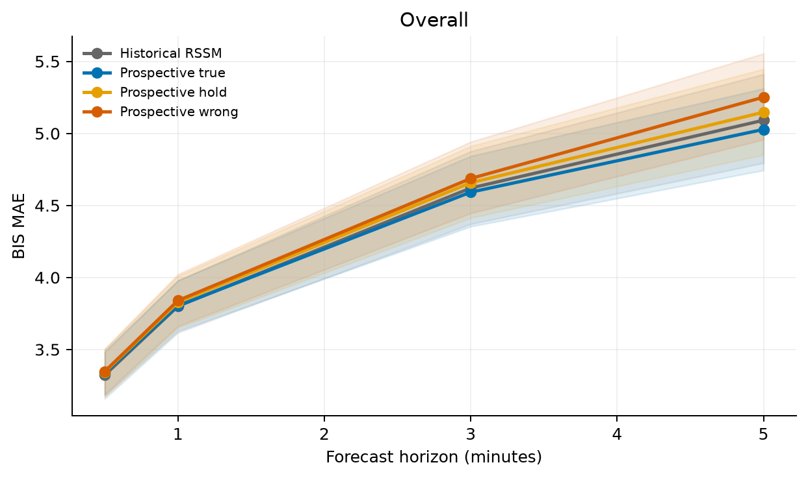
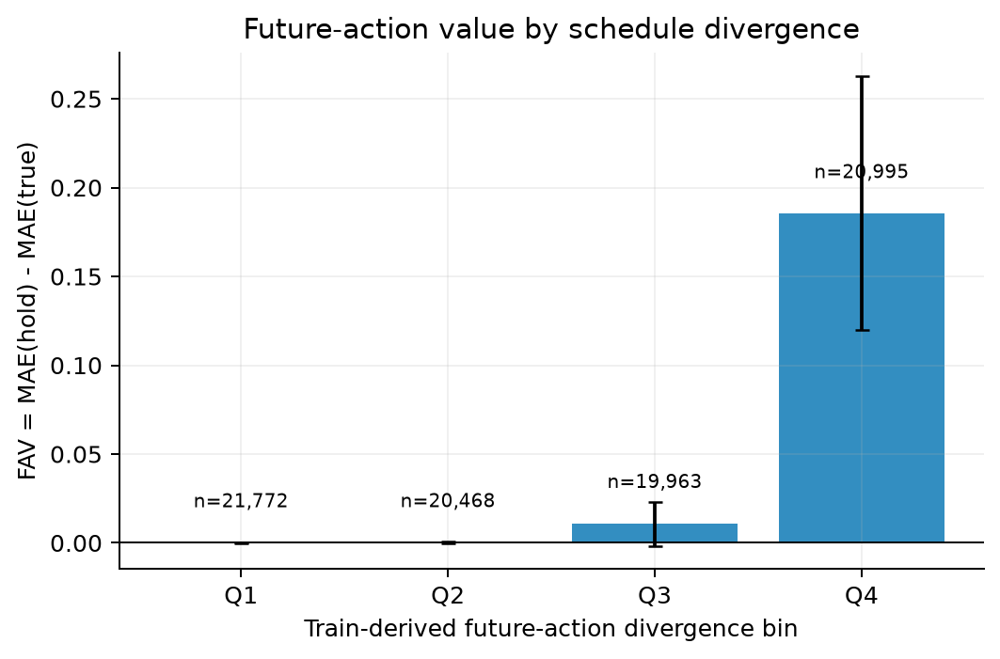
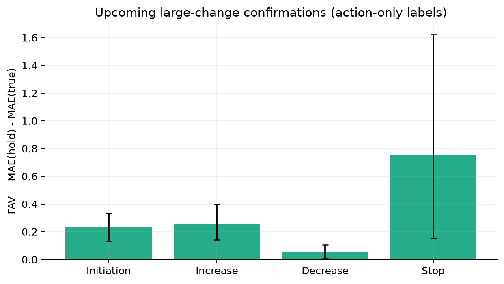
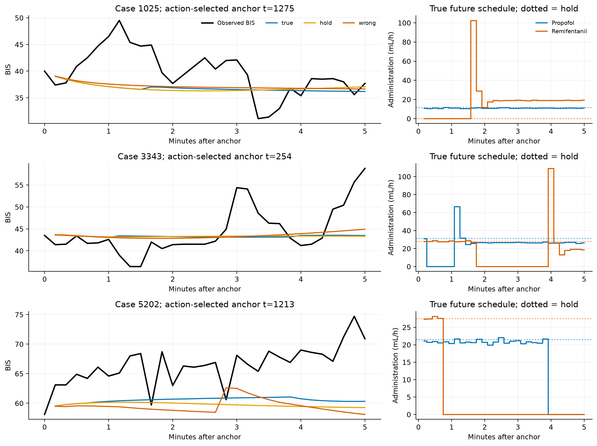
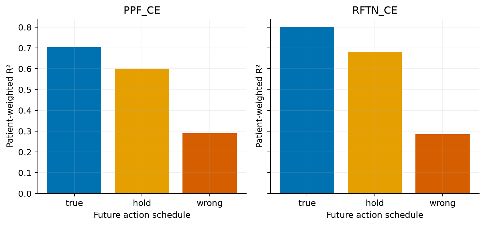

# VitalDB prospective-action diagnostic, seed 0

**Outcome C — Gap not supported.**

The evidence supports **Outcome C — Gap not supported** for this first prospective-action diagnostic. A compact prospective RSSM uses the observed future administration schedule in a predictable, patient-level measurable way. Holding the current action instead raises full-trajectory BIS MAE by 0.057 overall (95% patient-bootstrap CI 0.037–0.080) and 0.103 in the retained Round-1 large-change subset (0.068–0.145). Replacing the schedule with a physiologically matched different patient's future administration raises MAE by 0.098 overall (0.047–0.140) and 0.110 in that large-change subset (0.052–0.160). These comparisons hold the historical input, model weights and observed future physiology fixed.

The effect is concentrated where prospective schedules actually differ. FAV is about 0 in train-defined divergence bins Q1 and Q2, 0.011 in Q3 and 0.185 in Q4 (Q4 CI 0.120–0.263). The within-patient Q4-minus-Q1 FAV difference is 0.185 (CI 0.120–0.263) across 74 patients. The patient-level slope of FAV against log(1 + normalized schedule divergence) is 0.476 (CI 0.347–0.633). Around action-only upcoming large-change confirmations, FAV is 0.121 (CI 0.074–0.179). Upcoming initiation and increase show clear gains; decrease is smaller, and stop estimates are wide because only 35 patients contribute. The inherited ~18k-window large-change set reflects recently confirmed historical changes, so the divergence and upcoming-confirmation analyses carry the prospective timing argument.

The matched-capacity direct supervised control finds usable future-action information in the same dataset: on the retained large-change subset, adding true future actions improves MAE by 0.084 (CI 0.028–0.143). The prospective RSSM's same-model FAV of 0.103 is not markedly below this available headroom. Overall, the direct control gain is only 0.037 (CI -0.001–0.074), consistent with many stable-treatment windows. The historical RSSM's overall MAE is 4.333; the prospective RSSM obtains 4.311 with actual future actions and 4.368 when its own future input is held constant. The small cross-model aggregate gain should not be oversold: the diagnostic evidence is the paired schedule manipulation and its concentration in changing-treatment windows.

**The strongest effect depends on high-rate episodes.** Excluding windows whose current or future drug rate exceeds each drug's TRAIN positive-rate 99th percentile (76.85 mL/h propofol, 120.52 mL/h remifentanil) reduces Q4 FAV from 0.185 to 0.028 (CI -0.009–0.065) and upcoming-change FAV from 0.121 to 0.001 (CI -0.019–0.029). Under exactly that restriction, the direct supervised control also fails to obtain a positive future-action advantage: -0.009 on the retained large-change subset (CI -0.052–0.034) and -0.025 on upcoming changes (CI -0.071–0.019). A less severe 99.5th-percentile cap retains positive RSSM Q4 FAV of 0.082 (CI 0.040–0.125) and upcoming-change FAV of 0.041 (CI 0.015–0.068). The rate-tail analysis was added after seeing the first plots; it is exploratory and must not be portrayed as a preregistered robustness result. These transient high rates may represent real bolus-like dosing or recording artifacts; the current data cannot resolve every event's semantics. The evidence for prospective schedule use is therefore concentrated in high-intensity changes, and there is no demonstrated model-specific failure in the low-rate remainder.

Frozen future-latent probes offer secondary consistency evidence: true-action rollout latent trajectories predict device-computed PPF/RFTN TCI CE with R² 0.703/0.800; held-action rollout gives 0.600/0.682 and matched-wrong action gives 0.291/0.286. CE is a computed reference, not measured exposure or a forecasting training target.

These results reject the proposed premise that this standard action-conditioned RSSM encodes treatment history yet cannot meaningfully use a prospective treatment schedule. They do **not** establish causal treatment effects or complete physiological fidelity. Clinician responses, TCI controller behavior, concurrent unmeasured interventions, single-center data and a five-minute window remain limits. One held-out patient has no complete future-action window, leaving 74 patients in the primary analysis although the original 75-patient test split is preserved. No new action-controllability architecture is justified by this experiment. If the project continues, the next diagnostic should address variation in patient-specific response and generalization.

## Question and design

Can a history encoder with an action-conditioned latent transition use a prospective propofol/remifentanil administration schedule to predict BIS? This is conditional prediction on observed treatment choices, not identification of causal treatment effects. The first-round CE representation result motivated this question but is not reused as supervision. Both RSSMs use the exact same 58,946-parameter architecture, initialization seed, patient splits, training windows and per-epoch training indices. The only distinction is whether every rollout GRUCell receives the last historical action or the observed future action at that step. Both were trained from scratch under their respective schedules. Two matched-capacity direct supervised controls assess whether future actions are predictively informative under another model class.

## Data and integrity

Source: first experiment's VitalDB numeric case arrays. Exactly 495 source cases and 493 source patients; same train/validation/test IDs. Original windows and complete-future-action windows: `{"train": {"round1": 374521, "complete_future_action": 370566, "omitted_future_action": 3955}, "val": {"round1": 80341, "complete_future_action": 79574, "omitted_future_action": 767}, "test": {"round1": 83992, "complete_future_action": 83198, "omitted_future_action": 794}}`. One of the 75 held-out patients has no window with a complete future-action sequence, so primary analysis contains 74 test patients. Future medication is directly conditioned from t+1 through t+30; future BIS/MAP never enters features. Windows with an incomplete future medication sequence are omitted from **both** models and all comparisons. Both actions use the original RATE-preferred or cumulative-VOL fallback mL/10s trajectories and original train-only normalization. Missing past values have explicit masks. TCI CE is reference-only.

Automated checks: `{"patient_splits_disjoint": true, "same_round1_caseids_and_normalization": true, "future_action_starts_at_t_plus_1": true, "future_action_from_action_channels_only": true, "ce_mutation_no_forecast_feature_or_target_effect": true, "future_physiology_mutation_no_input_effect": true, "target_mutation_no_prediction_effect": true, "hold_ignores_future_action": true, "true_responds_to_future_action": true, "forecast_loss_uses_only_BIS_MAP": true, "normalization_train_only_inherited": true, "parameter_count_each": 58946}`. Matched-wrong future schedules are selected from other TEST patients by current BIS/HR/MAP within 0.5 training SD and future dose-sequence RMS distance >=0.25 training action SD. Matching never uses future physiology or CE. Matched coverage: 81749 / 83198 test windows.

The inherited Round-1 large-change labels are **confirmed historical events at or before t** (the 2-minute post-confirmation window). They are retained as the specified ~18k subset, but are not automatically upcoming intervention changes. A separate action-only upcoming label requires a large-change confirmation from t+60 to t+300 seconds, reducing the chance that the change began before t. The high-future-divergence and train-derived Q1–Q4 analyses directly target prospective variation. Quantile protocol: `{"train_quantile_boundaries": [0.014645308256149292, 0.025655917823314667, 0.48343008756637573], "train_windows_with_defined_current_and_future_action": 370557, "scale_train_raw_action_sd": [0.08849398791790009, 0.08466942608356476], "zero_fraction_test": 0.03179162960648092, "bin_counts": {"Q1": 21772, "Q2": 20468, "Q3": 19963, "Q4": 20995}, "definition": "RMS over 30x2 physical actions, divided by train action SD; zero ties assigned lower bin"}`. Empty bins, if any, reflect tied train quantiles and are not merged after test inspection.

## Models and training

10-second samples; 180 historical steps; 30 future steps; BIS primary and arterial MAP secondary. Standardized BIS MSE + 0.25 MAP MSE, AdamW, fixed seed 0, 80,000 distinct shared train windows per epoch, up to 20 epochs and validation-only early stopping. No CE loss, hyperparameter search or architecture modification of the central RSSM. Model summary:

| model | policy | parameters | best_epoch | epochs_run | best_val_bis_mae | train_windows | windows_per_epoch | seconds |
| --- | --- | --- | --- | --- | --- | --- | --- | --- |
| Historical RSSM | hold | 58946 | 14 | 19 | 3.936 | 370566 | 80000 | 308.445 |
| Prospective RSSM | true | 58946 | 14 | 19 | 3.920 | 370566 | 80000 | 275.017 |

Direct supervised informativeness controls:

| model | use_future | parameters | best_epoch | epochs_run | best_val_bis_mae | seconds |
| --- | --- | --- | --- | --- | --- | --- |
| Direct history control | False | 60348 | 8 | 13 | 3.929 | 94.668 |
| Direct future control | True | 60348 | 9 | 14 | 3.891 | 92.920 |

## Main table

The MAE columns below are patient-weighted averages over the entire 5-minute BIS trajectory. FAV and MFAV are paired differences on the large-change subset; matched-wrong comparisons use matched windows only.

| Model / Action Condition | Overall 5m MAE | Large-change 5m MAE | Initiation | Increase | Decrease | Stop | FAV | MFAV |
| --- | --- | --- | --- | --- | --- | --- | --- | --- |
| Historical RSSM / hold | 4.333 | 4.773 | 4.437 | 5.164 | 4.741 | 5.464 | NA | NA |
| Prospective RSSM / true | 4.311 | 4.727 | 4.382 | 5.119 | 4.698 | 5.309 | 0.103 | 0.110 |
| Prospective RSSM / hold | 4.368 | 4.831 | 4.468 | 5.235 | 4.807 | 5.410 | NA | NA |
| Prospective RSSM / wrong | 4.406 | 4.845 | 4.471 | 5.244 | 4.855 | 5.378 | NA | NA |

## Horizons and paired comparisons

Point errors are at t+30, 60, 180 and 300 seconds. `horizon_seconds=0` denotes full five-minute trajectory. All intervals use 1,000 patient-cluster bootstrap replicates; patients contribute equal weight, preserving within-patient window dependence.

| model | condition | subset | mae | ci_low | ci_high | n_windows | n_patients |
| --- | --- | --- | --- | --- | --- | --- | --- |
| Historical RSSM | hold | overall | 4.333 | 4.115 | 4.560 | 83198 | 74 |
| Historical RSSM | hold | large_transition | 4.773 | 4.500 | 5.043 | 18152 | 74 |
| Historical RSSM | hold | high_future_divergence | 4.916 | 4.536 | 5.324 | 20995 | 74 |
| Prospective RSSM | true | overall | 4.311 | 4.102 | 4.529 | 83198 | 74 |
| Prospective RSSM | true | large_transition | 4.727 | 4.474 | 4.983 | 18152 | 74 |
| Prospective RSSM | true | high_future_divergence | 4.829 | 4.489 | 5.199 | 20995 | 74 |
| Prospective RSSM | hold | overall | 4.368 | 4.149 | 4.594 | 83198 | 74 |
| Prospective RSSM | hold | large_transition | 4.831 | 4.563 | 5.106 | 18152 | 74 |
| Prospective RSSM | hold | high_future_divergence | 5.015 | 4.636 | 5.435 | 20995 | 74 |
| Prospective RSSM | zero | overall | 4.511 | 4.280 | 4.740 | 83198 | 74 |
| Prospective RSSM | zero | large_transition | 4.913 | 4.657 | 5.175 | 18152 | 74 |
| Prospective RSSM | zero | high_future_divergence | 5.079 | 4.717 | 5.481 | 20995 | 74 |
| Prospective RSSM | wrong | overall | 4.406 | 4.185 | 4.636 | 81749 | 74 |
| Prospective RSSM | wrong | large_transition | 4.845 | 4.580 | 5.117 | 17833 | 74 |
| Prospective RSSM | wrong | high_future_divergence | 4.955 | 4.584 | 5.369 | 20642 | 74 |

| comparison | subset | difference_mae | ci_low | ci_high | n_windows | n_patients |
| --- | --- | --- | --- | --- | --- | --- |
| FAV | overall | 0.057 | 0.037 | 0.080 | 83198 | 74 |
| MFAV | overall | 0.098 | 0.047 | 0.140 | 81749 | 74 |
| ZFAD | overall | 0.200 | 0.162 | 0.239 | 83198 | 74 |
| FAV | large_transition | 0.103 | 0.068 | 0.145 | 18152 | 74 |
| MFAV | large_transition | 0.110 | 0.052 | 0.160 | 17833 | 74 |
| ZFAD | large_transition | 0.186 | 0.134 | 0.244 | 18152 | 74 |
| FAV | upcoming_large_transition | 0.121 | 0.074 | 0.179 | 26939 | 74 |
| MFAV | upcoming_large_transition | 0.112 | 0.074 | 0.156 | 26466 | 74 |
| ZFAD | upcoming_large_transition | 0.248 | 0.190 | 0.311 | 26939 | 74 |
| FAV | high_future_divergence | 0.185 | 0.120 | 0.263 | 20995 | 74 |
| MFAV | high_future_divergence | 0.127 | 0.073 | 0.186 | 20642 | 74 |
| ZFAD | high_future_divergence | 0.249 | 0.182 | 0.317 | 20995 | 74 |

## Future-action divergence and event types

| subset | difference_mae | ci_low | ci_high | n_windows | n_patients |
| --- | --- | --- | --- | --- | --- |
| Q1 | 0.000 | -0.000 | 0.000 | 21772 | 74 |
| Q2 | 0.000 | -0.000 | 0.001 | 20468 | 74 |
| Q3 | 0.011 | -0.002 | 0.023 | 19963 | 74 |
| Q4 | 0.185 | 0.120 | 0.263 | 20995 | 74 |

Patient-level trend tests (1,000 cluster bootstrap replicates):

| test | estimate | ci_low | ci_high | n_patients |
| --- | --- | --- | --- | --- |
| within_patient_log1p_divergence_slope | 0.476 | 0.347 | 0.631 | 74 |
| paired_patient_Q4_minus_Q1_FAV | 0.185 | 0.120 | 0.263 | 74 |

| subset | difference_mae | ci_low | ci_high | n_windows | n_patients |
| --- | --- | --- | --- | --- | --- |
| initiation | 0.086 | 0.033 | 0.146 | 4090 | 71 |
| increase | 0.116 | 0.001 | 0.242 | 2999 | 68 |
| decrease | 0.109 | 0.075 | 0.154 | 10396 | 74 |
| stop | 0.101 | -0.088 | 0.298 | 667 | 33 |

Upcoming confirmed event types:

| subset | difference_mae | ci_low | ci_high | n_windows | n_patients |
| --- | --- | --- | --- | --- | --- |
| upcoming_initiation | 0.235 | 0.133 | 0.335 | 4390 | 71 |
| upcoming_increase | 0.259 | 0.141 | 0.398 | 3785 | 67 |
| upcoming_decrease | 0.052 | 0.004 | 0.106 | 18081 | 74 |
| upcoming_stop | 0.755 | 0.152 | 1.627 | 683 | 35 |

### High-rate episode sensitivity

Some Q4 schedules contain brief high pump rates. As an exploratory check, exclude any window where the current or future dose exceeds the TRAIN positive-rate 99th or 99.5th percentile for either drug. This removes potentially informative bolus-like episodes as well as possible rate artifacts, so a reduced FAV does not by itself establish model failure. Cutoffs and retained window counts: `{"0.99": {"maximum_ml_per_10s": [0.21347995102405548, 0.33479106426239014], "maximum_ml_per_h": [76.85278236865997, 120.52478313446045], "n_test_clean_windows": 66139}, "0.995": {"maximum_ml_per_10s": [0.6134177446365356, 0.7391403317451477], "maximum_ml_per_h": [220.83038806915283, 266.0905194282532], "n_test_clean_windows": 76523}}`. The direct-control value is recomputed on exactly the same restricted windows.

| train_positive_rate_quantile_cap | subset | metric | difference_mae | ci_low | ci_high | n_windows | n_patients |
| --- | --- | --- | --- | --- | --- | --- | --- |
| 0.990 | overall | FAV | 0.005 | 0.001 | 0.011 | 66139 | 74 |
| 0.990 | overall | MFAV | 0.080 | 0.018 | 0.127 | 64964 | 74 |
| 0.990 | overall | Direct future value | -0.022 | -0.056 | 0.006 | 66139 | 74 |
| 0.990 | Q4 | FAV | 0.028 | -0.009 | 0.065 | 4959 | 74 |
| 0.990 | Q4 | MFAV | 0.032 | -0.031 | 0.107 | 4877 | 74 |
| 0.990 | Q4 | Direct future value | -0.069 | -0.144 | 0.001 | 4959 | 74 |
| 0.990 | large_transition | FAV | 0.023 | 0.012 | 0.034 | 12258 | 74 |
| 0.990 | large_transition | MFAV | 0.074 | 0.015 | 0.122 | 12071 | 74 |
| 0.990 | large_transition | Direct future value | -0.009 | -0.052 | 0.034 | 12258 | 74 |
| 0.990 | upcoming_large_transition | FAV | 0.006 | -0.019 | 0.029 | 12426 | 74 |
| 0.990 | upcoming_large_transition | MFAV | 0.048 | 0.013 | 0.081 | 12211 | 74 |
| 0.990 | upcoming_large_transition | Direct future value | -0.025 | -0.071 | 0.019 | 12426 | 74 |
| 0.995 | overall | FAV | 0.022 | 0.012 | 0.032 | 76523 | 74 |
| 0.995 | overall | MFAV | 0.084 | 0.030 | 0.127 | 75180 | 74 |
| 0.995 | overall | Direct future value | 0.003 | -0.032 | 0.033 | 76523 | 74 |
| 0.995 | Q4 | FAV | 0.082 | 0.040 | 0.125 | 14320 | 74 |
| 0.995 | Q4 | MFAV | 0.088 | 0.030 | 0.159 | 14073 | 74 |
| 0.995 | Q4 | Direct future value | 0.054 | -0.017 | 0.129 | 14320 | 74 |
| 0.995 | large_transition | FAV | 0.049 | 0.032 | 0.066 | 15806 | 74 |
| 0.995 | large_transition | MFAV | 0.082 | 0.025 | 0.129 | 15540 | 74 |
| 0.995 | large_transition | Direct future value | 0.036 | -0.011 | 0.084 | 15806 | 74 |
| 0.995 | upcoming_large_transition | FAV | 0.041 | 0.015 | 0.068 | 20976 | 74 |
| 0.995 | upcoming_large_transition | MFAV | 0.074 | 0.046 | 0.102 | 20603 | 74 |
| 0.995 | upcoming_large_transition | Direct future value | 0.036 | -0.009 | 0.080 | 20976 | 74 |

## Future-action informativeness control

The two generic direct supervised models share architecture, parameters, initialization, optimizer, training windows and validation. One gets historical features only; the other additionally receives the observed future action sequence. Their patient-paired difference measures predictive information available to this supervised class, not a causal treatment effect.

| subset | horizon_seconds | direct_future_value | ci_low | ci_high | n_windows | n_patients |
| --- | --- | --- | --- | --- | --- | --- |
| overall | 0 | 0.037 | -0.001 | 0.074 | 83198 | 74 |
| large_transition | 0 | 0.084 | 0.028 | 0.143 | 18152 | 74 |
| high_future_divergence | 0 | 0.155 | 0.071 | 0.247 | 20995 | 74 |
| initiation | 0 | 0.034 | -0.036 | 0.106 | 4090 | 71 |
| increase | 0 | 0.134 | 0.003 | 0.287 | 2999 | 68 |
| decrease | 0 | 0.090 | 0.025 | 0.162 | 10396 | 74 |
| stop | 0 | 0.328 | -0.019 | 0.738 | 667 | 33 |

## Representative patient schedules

Cases are fixed by sorted percentiles among test cases with a matched Q4 window below the TRAIN positive-rate 99th-percentile dose cap. Within each case, the plotted anchor has median divergence among such windows. Selection uses only dose schedules and matching, never physiological outcomes or model errors. This avoids choosing transient extreme-rate episodes just for visual drama.

## Frozen future-latent TCI-reference probe

The forecasting model is frozen. Ridge probes are fit on sampled TRAIN future latent trajectories to device-computed TCI CE at each future step and evaluated on TEST patients. They receive no gradients through the forecaster. This is a secondary exposure consistency audit, not measured concentration or causal fidelity.

| condition | drug | horizon_seconds | r2 | mae | pearson | n_points | n_patients |
| --- | --- | --- | --- | --- | --- | --- | --- |
| true | PPF_CE | 0 | 0.703 | 0.309 | 0.843 | 2495940 | 74 |
| true | RFTN_CE | 0 | 0.800 | 0.468 | 0.895 | 2495940 | 74 |
| hold | PPF_CE | 0 | 0.600 | 0.341 | 0.791 | 2495940 | 74 |
| hold | RFTN_CE | 0 | 0.682 | 0.543 | 0.833 | 2495940 | 74 |
| wrong | PPF_CE | 0 | 0.291 | 0.496 | 0.579 | 2452470 | 74 |
| wrong | RFTN_CE | 0 | 0.286 | 0.960 | 0.571 | 2452470 | 74 |

## Protocol and implementation amendments

1. **Divergence quantiles corrected after the first evaluation pass.** Nine of 370,566 eligible TRAIN windows had a missing current action despite complete future actions. Their undefined `D_future` contaminated the initial quantile calculation with NaN boundaries, placing every test window in Q1. The final calculation excludes only those nine undefined training divergences; it uses 370,557 TRAIN windows and yields finite thresholds 0.01465, 0.02566 and 0.48343. The saved final quartile metrics, trend tests and plots were recomputed. Forecast models, checkpoints, matched donors and primary overall/large-change errors were unaffected and were not refit. `logs/evaluate.log` records the first pass; `logs/evaluate_corrected.log` records the reported pass.
2. **Upcoming-change labels added for interpretation.** The inherited Round-1 large-change window label refers to a recently confirmed historical change. An additional action-only label identifies a confirmation between 60 and 300 seconds after the forecast anchor. It supplements rather than replaces the inherited 18,152-window subset and has an imprecise onset time because confirmation uses a trailing median.
3. **High-rate episode sensitivity added after examining the figures.** Brief high pump-rate episodes dominated examples selected by maximum future-action divergence. The supplementary sensitivity excludes windows whose current or future administration exceeds each drug's TRAIN positive-rate 99th or 99.5th percentile, and recomputes RSSM and direct-control gains on the same retained windows. This restriction removes both possible artifacts and potentially genuine high-dose interventions. It is exploratory, with the unrestricted primary results retained. The representative case plot now selects matched Q4 windows below the 99th-percentile cap by action information alone.

## Interpretation and limits

The 5-minute horizon may be short relative to pharmacodynamic effects. Device-controlled TCI administration and unmeasured concurrent actions confound observational schedule-response interpretation. The data are one center and one seed. The labels of the Round-1 large-change subset refer to recently confirmed changes, so direct claims about upcoming changes must rely on divergence and future-event analyses. Even the upcoming confirmations use a trailing median and do not precisely timestamp action onset. TCI CE is computed by the device and is not measured exposure. A predictive gain from known future treatment does not prove physiological causal controllability; likewise, no gain in a dataset without direct future-action information does not establish model failure.

**Final evidence classification: Outcome C — Gap not supported.**
