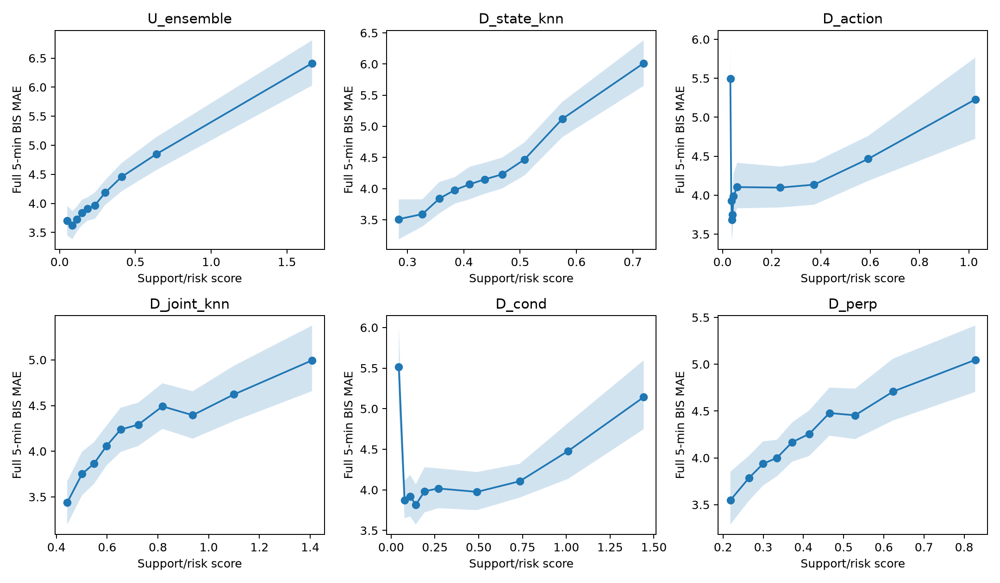
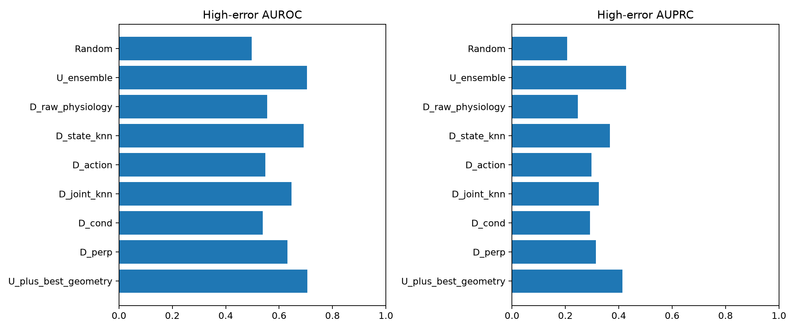
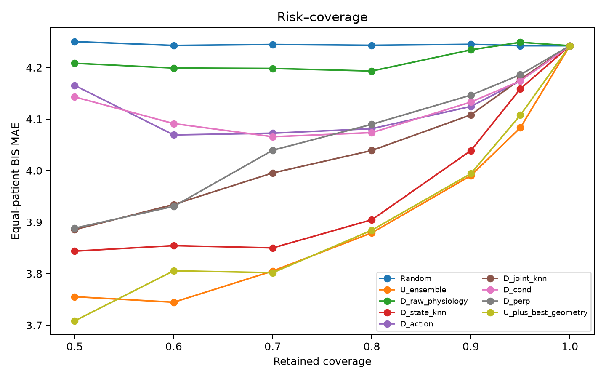
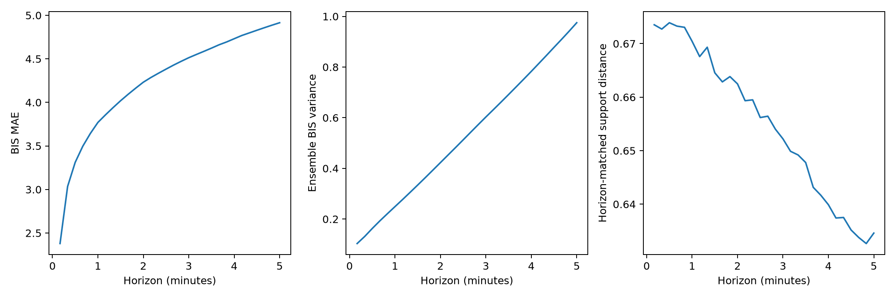
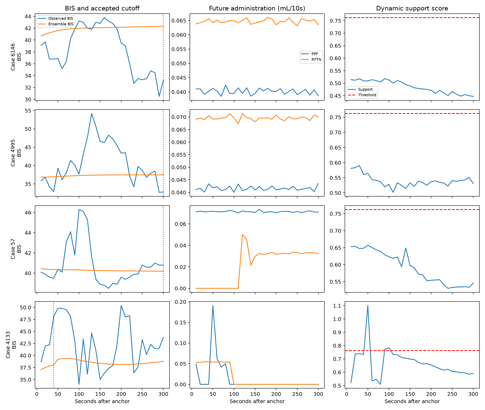
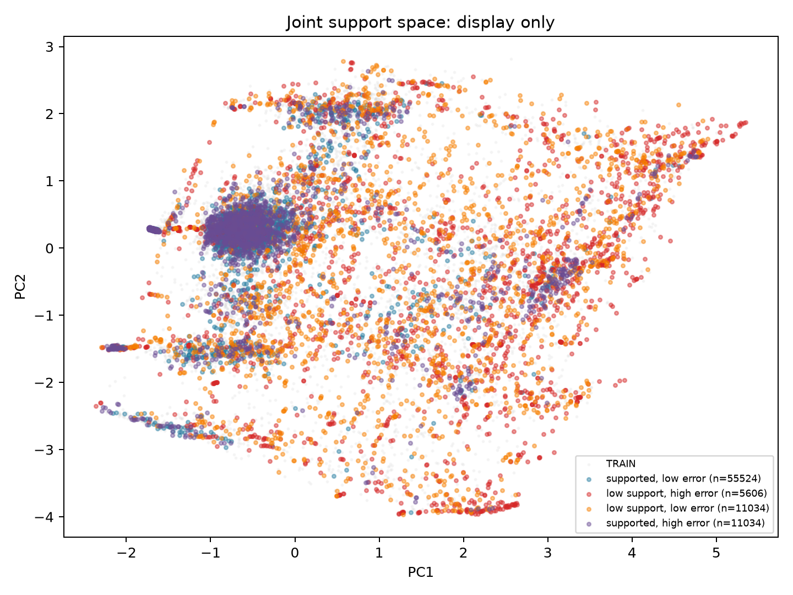

# VitalDB training-support geometry diagnostic

**Final evidence classification: Outcome B — Partial support.** Training-support geometry carries some information about factual BIS rollout error, concentrated in the learned **state** representation. State kNN distance has patient-weighted Spearman correlation 0.292 (95% patient-cluster bootstrap CI 0.215–0.360) with five-minute trajectory MAE, substantially above a raw current-physiology support score (0.061) and a random-latent control (−0.004). The central patient–intervention geometry claim is much weaker: joint kNN, conditional action support, and local tangent residual do not beat ensemble uncertainty, and a validation-trained ensemble-plus-state score gives no test AUROC gain (paired difference 0.002, CI −0.017–0.021) and a lower AUPRC (−0.015, CI −0.031 to −0.001). Dynamic support does not progressively deteriorate as rollout error increases. A transition-aware geometry model is **not justified** by these data; the narrower surviving observation is that unfamiliar learned patient states are riskier, largely overlapping with conventional ensemble uncertainty.

## 1. Cohort, variables, and model

The numeric-only VitalDB cohort and preprocessing are inherited exactly from [Round 1](../../vitaldb_intervention_grounding_seed0_v1/outputs/FINAL_REPORT.md) and the complete-future-action window rule from [Round 2](../../vitaldb_prospective_action_seed0_v1/outputs/FINAL_REPORT.md). There are **495 cases and 493 unique patients**, with subject-disjoint train/validation/test splits of **345/74/76 cases** and **345/73/75 patients**. The eligible complete-action windows number **370,566/79,574/83,198**. One original test patient has no complete future-action window, leaving **74 effective test patients**. No new waveform download or cohort filtering was performed. Exact IDs and normalization are inherited in the cited experiments and their JSON outputs; [data_summary.json](data_summary.json) records the reused source identity and counts.

Sampling is every 10 seconds, with 180 history steps and 30 forecast steps. The model receives historical BIS, HR, MAP, propofol/remifentanil administration, demographics and observation masks, plus the **observed prospective administration** for the next 30 steps. BIS is the primary outcome; MAP is retained in the unchanged training objective (standardized BIS MSE + 0.25 standardized MAP MSE). Propofol/remifentanil are the same RATE-preferred mL/10s numeric trajectories, with cumulative-volume fallback and train-only normalization documented in Round 1. Device-computed PPF/RFTN TCI CE is absent from all forecasting and support features. No future physiological outcome is an input.

The deterministic prospective-action RSSM is unchanged: two-layer width-64 GRU history encoder, 64-dimensional LayerNorm latent, GRUCell transition using each future action, and a small residual physiology decoder, **58,946 parameters** per seed. Seed 0 is the exact Round-2 checkpoint: its new test predictions have maximum absolute difference **0.0** from Round 2. Seeds 1–4 were independently trained with the same model, objective, 80,000 sampled training windows per epoch, AdamW settings, 20-epoch maximum, five-epoch patience, validation stride 6 and prospective conditioning; only random seeds and their epoch permutations change. No seed-specific tuning was done.

| Seed | Best epoch | Validation BIS MAE |
| ---: | ---: | ---: |
| 0 (reused) | 14 | 3.920 |
| 1 | 11 | 3.912 |
| 2 | 14 | 3.923 |
| 3 | 13 | 3.909 |
| 4 | 11 | 3.912 |

Every test-window seed prediction and the ensemble BIS mean/variance at every forecast step are saved on the experiment server under `outputs/arrays/`. The uncertainty score is the **population variance across five physical-unit BIS predictions** at each step; the full-trajectory score is the average of the 30 step variances. The patient-weighted ensemble-mean factual BIS MAE is **4.242** (95% CI 4.034–4.458) over five minutes, versus Round-2 seed-0 prospective RSSM 4.311 on the same windows. At 30/60/180/300 seconds the ensemble MAE is **3.311/3.770/4.513/4.915**. This experiment tests reliability of those factual forecasts; it does not simulate treatment counterfactuals.

## 2. Support reference and leakage controls

The frozen seed-0 encoder gives a 64-dimensional current latent for **every one** of the 370,566 eligible TRAIN windows. The full 30×2 future action trajectory is stored with each latent. Another 368,467 adjacent eligible training-window pairs supply factual next-history transitions. Static scores use TRAIN-fitted means/scales and the following features:

- **State:** 20th-neighbor distance and 5%-shrinkage Mahalanobis distance in normalized latent space.
- **Action:** flattened 60-value schedule distance, 14-feature mean/max/final/total/variation/change summary distance, and a separate TRAIN marginal dose-frequency baseline.
- **Joint:** state and 14-feature action-summary blocks, each divided by the square root of its dimension, with kNN and Mahalanobis scores.
- **Conditional:** minimum action-schedule distance among the 20, 50 or 100 nearest TRAIN latent states. Equal-patient-weighted VALIDATION high-error AUPRC selected **k=100** (0.28297 versus 0.28285 for k=20). The small difference has no substantive interpretation.
- **Local tangent:** PCA of each query's 20 TRAIN joint neighbors, keeping 90% of local TRAIN variance; the orthogonal displacement is `D_perp`. Median retained tangent dimension is 6 on TEST (10th–90th percentile 4–7).

Static nearest-neighbor search uses FAISS IVFFlat with 256 lists and 24 probes. On a fixed 128-query validation audit, recall@20 against exact search is **99.65% state, 98.52% flattened action, 99.77% joint**; median relative error in the 20th-neighbor distance is 0 for all three. The exact implementation and neighborhood diagnostics are in [support_reference_summary.json](support_reference_summary.json). A random replacement of the 64 latent coordinates is the negative control. An orthogonal random rotation was omitted because it is an isometry for Euclidean distance and therefore cannot falsify Euclidean geometry.

For dynamic support, 50,000 TRAIN windows selected with a fixed seed are rolled out by the frozen seed-0 RSSM. A TEST predicted `(z_h, a_h)` is compared with TRAIN predicted transitions at the **same horizon h**, then divided by that horizon's TRAIN 95th-percentile within-bank distance. This avoids mistaking normal rollout-depth drift for loss of support. This dynamic bank is sampled; the primary static bank is exhaustive. No TEST future BIS/MAP or CE enters any geometry calculation. Validation outcomes alone select conditional k, the best geometry feature for a two-input logistic combination, and selective-rollout thresholds. Direct mutation checks confirm that future physiology, CE and target changes leave model inputs or predictions unchanged. All [integrity checks](integrity_checks.json) and [completion checks](completion_checks.json) passed.

## 3. Primary trust table

High error means the top 20% of TEST full-trajectory BIS MAE, threshold **5.427**. This TEST threshold defines evaluation labels only. AUPRC uses equal-patient weights, so its random prevalence is approximately 0.207 rather than necessarily 0.200. Risk is patient-weighted BIS MAE among retained windows; lower is better. AURC is the area under risk–coverage from 50% to 100%, divided by that 0.5 coverage width. The combined logistic score uses ensemble variance and state kNN, the best geometry feature selected by VALIDATION AUPRC.

| Trust signal | Spearman(error) | High-error AUROC | High-error AUPRC | Risk@90% | Risk@80% | AURC |
| --- | ---: | ---: | ---: | ---: | ---: | ---: |
| Random | −0.003 | 0.497 | 0.207 | 4.245 | 4.243 | 4.244 |
| Ensemble uncertainty | 0.293 | **0.705** | **0.428** | **3.990** | **3.879** | 3.880 |
| Raw physiology support | 0.061 | 0.556 | 0.247 | 4.234 | 4.193 | 4.211 |
| State kNN | 0.292 | 0.691 | 0.367 | 4.039 | 3.905 | 3.940 |
| State Mahalanobis | 0.284 | 0.696 | 0.369 | 4.038 | 3.924 | 3.908 |
| Action support (flattened) | 0.081 | 0.549 | 0.297 | 4.124 | 4.081 | 4.109 |
| Joint kNN | 0.230 | 0.646 | 0.326 | 4.108 | 4.039 | 4.028 |
| Joint Mahalanobis | 0.280 | 0.692 | 0.364 | 4.050 | 3.883 | **3.866** |
| Conditional action support | 0.054 | 0.539 | 0.292 | 4.133 | 4.074 | 4.110 |
| Local tangent residual | 0.205 | 0.632 | 0.314 | 4.146 | 4.090 | 4.053 |
| Ensemble + best geometry | **0.312** | 0.706 | 0.413 | 3.994 | 3.884 | 3.891 |

The joint Mahalanobis score has a slightly lower point AURC than ensemble variance, but that does **not** establish superiority: at 90% coverage it has **0.060 higher MAE** (paired patient-bootstrap CI for ensemble-minus-joint risk −0.093 to −0.023), and at 80% coverage the difference is −0.004 (CI −0.045–0.045). State kNN's high-error AUPRC is 0.061 lower than ensemble (paired CI −0.084 to −0.040); joint Mahalanobis is 0.064 lower (−0.087 to −0.040). Combining state kNN with ensemble uncertainty changes AUROC by only +0.002 (CI −0.017–0.021) and lowers AUPRC by 0.015 (CI −0.031 to −0.001). The best static geometry's signal is therefore largely redundant with, or weaker than, conventional ensemble variance on the tested failure task.

The state kNN error correlation has a positive **1,000-replicate patient-cluster bootstrap** interval **0.215–0.360**, with a positive error trend across score quintiles (MAE increase per quintile 0.468, CI 0.391–0.545). Joint Mahalanobis also has a positive trend. Flattened action support has only weak correlation **0.081** (CI 0.011–0.148) and its quintile trend interval crosses zero; conditional action support correlation **0.054** (CI −0.009–0.115) and trend likewise do not distinguish it from no association. The random-latent score is near chance, while the random-latent-plus-real-action score still has some signal from the action block. All point estimates, Pearson correlations, quintile values and patient-cluster intervals are in [error_support_correlations.csv](error_support_correlations.csv) and [failure_detection_metrics.csv](failure_detection_metrics.csv). The top-10% TEST error check repeats the ordering: ensemble AUROC/AUPRC **0.734/0.290**, state kNN **0.719/0.227**, joint Mahalanobis **0.727/0.223**, and combined **0.735/0.278**.

## 4. Horizon reliability and selective rollout

| Horizon | Factual BIS MAE | Ensemble variance | Horizon-matched dynamic distance | Spearman(U, error) | Spearman(Dynamic distance, error) |
| ---: | ---: | ---: | ---: | ---: | ---: |
| 30 s | 3.311 | 0.163 | 0.674 | 0.093 | 0.102 |
| 60 s | 3.770 | 0.249 | 0.670 | 0.093 | 0.119 |
| 180 s | 4.513 | 0.603 | 0.652 | 0.176 | 0.159 |
| 300 s | 4.915 | 0.975 | 0.635 | 0.215 | 0.158 |

Error and ensemble variance rise with horizon; the horizon-normalized dynamic distance **decreases** on average. Its pointwise error association stays modest and is below ensemble variance at 180 and 300 seconds. The distance and variance are correlated across windows, but this does not establish an out-of-support progression that precedes error. Full 30-step values and bootstrap intervals are in [horizon_reliability_metrics.csv](horizon_reliability_metrics.csv).

Validation-only selective thresholds were chosen to maximize accepted duration subject to equal-patient accepted BIS MAE targets of 3.5, 4.0, 4.5 and 5.0. The formal output calls this a **selective rollout horizon**, with no clinical safety claim. At the nontrivial validation target 3.5, dynamic support accepts a mean **180 s**, with TEST accepted MAE **3.648** and 49.0% full trajectories accepted. Ensemble variance accepts **198 s** at TEST accepted MAE **3.622** and 48.2% full trajectories accepted. The immediately rejected-step MAE is **3.497** for dynamic support versus **4.259** for ensemble variance; this descriptive check gives no evidence that the geometry threshold identifies an especially dangerous next step. The full five-minute baseline has MAE **4.242**. For targets 4.0/4.5/5.0, validation already meets the target with a full rollout, so both policies accept all 300 seconds on TEST. See [selective_rollout_metrics.csv](selective_rollout_metrics.csv).

## 5. Transition, tail, and patient heterogeneity

The Round-2 TRAIN-defined Q4 future-action-divergence subset contains **20,995** test windows; its patient-weighted BIS MAE is **4.767**. Within this subgroup, ensemble error Spearman is **0.343**, joint kNN **0.203**, and conditional action support **0.143**. The **26,939** windows with an upcoming large pump change have MAE **4.471**, with ensemble/joint kNN Spearman **0.335/0.221**. Specific initiation/increase/decrease/stop rows are saved in [subgroup_metrics.csv](subgroup_metrics.csv); stop has only **683 windows across 35 patients**, making its estimates especially uncertain.

High-rate-tail windows are **retained** in all primary analyses. The Round-2 TRAIN positive-rate 99th-percentile cutoffs identify **17,059** tail windows from 73 patients, with MAE **4.902**, compared with **4.067** for 66,139 non-tail windows. Within the tail, ensemble error Spearman is **0.322** and joint kNN **0.201**; in the non-tail subset they are **0.248/0.184**. Conditional support is weak in the tail (0.145) and slightly negative outside it (−0.043). The earlier high-rate ambiguity remains: some episodes may be real bolus-like dosing, others recording artifacts. Removing them would change the scientific question. Across effective TEST patients, patient-mean BIS MAE ranges **2.303–7.879** (median **4.224**); overlapping windows must not be treated as independent.

Four displayed test cases were selected by prespecified joint-support quantiles and distinct patients, without using their errors. The PCA panel is **visualization only**, fitted on TRAIN joint features. Its four classes reveal failure modes missed by a simple support rule: **11,034** well-supported high-error windows and **11,034** low-support low-error windows under descriptive top-20% cutoffs, alongside 55,524 supported low-error and 5,606 low-support high-error windows. PCA positions are not used as distances in the analysis.

## 6. Interpretation and limits

The narrower state-support association is real within this held-out split and above raw current BIS/HR/MAP-plus-demographics support. It does **not** show that joint patient–intervention distance is the right trust metric. Flattened and conditional action support are weak, local tangent residual is inferior to simpler state distance, and the best geometry does not improve ensemble error detection or selective rollout. The present result favors auditing state familiarity and ensemble calibration before designing a transition-aware support geometry. It does not justify claiming a new geometry-grounded world model.

This is one center, one patient split, one compact deterministic RSSM family and a five-minute horizon. Five seeds provide an ensemble baseline but not architecture uncertainty. Highly overlapping 10-second windows and uneven per-patient recording lengths can make support distance reflect sampling density or case mix. Dynamic reference trajectories use 50,000 sampled TRAIN windows, even though static support uses all eligible windows. The support scores have no external-site validation or clinical calibration. Future administration is observed in this retrospective test, not an intervention randomized independently of clinician and TCI-controller behavior. CE is only a device-computed reference, and high pump-rate tails retain unresolved semantics. Patient-cluster intervals address window dependence within this cohort; they cannot establish transportability or causality.

**Outcome B — Partial support.** There is a reproducible learned-state familiarity signal, but the stronger intervention-geometry, complementarity, and selective-rollout claims do not survive comparison with ensemble uncertainty. A subsequent study should test that narrower state-familiarity signal on independent patients/sites and longer horizons before proposing a support-aware model.
