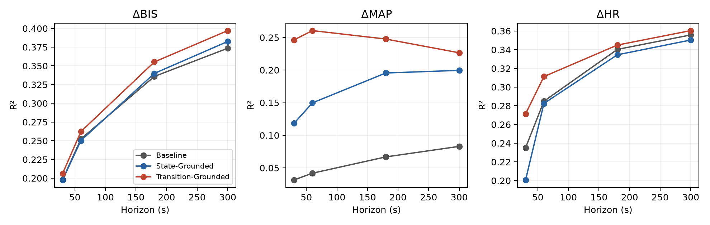
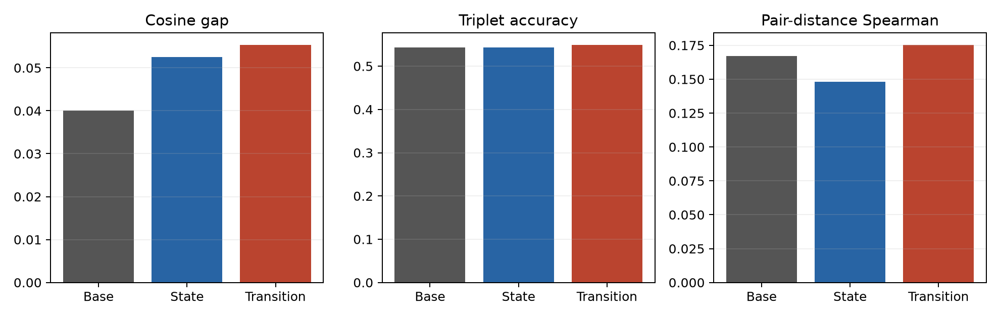
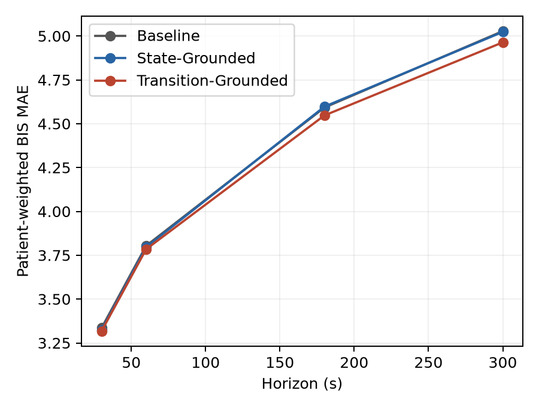
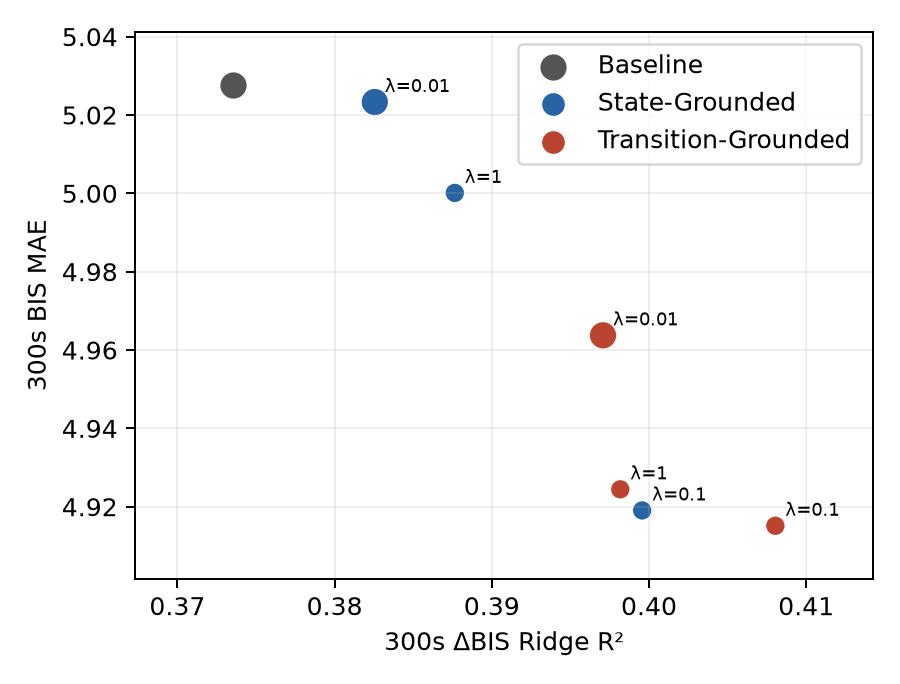
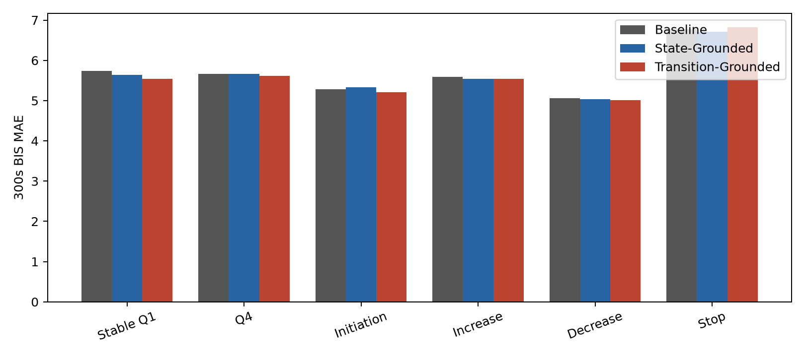
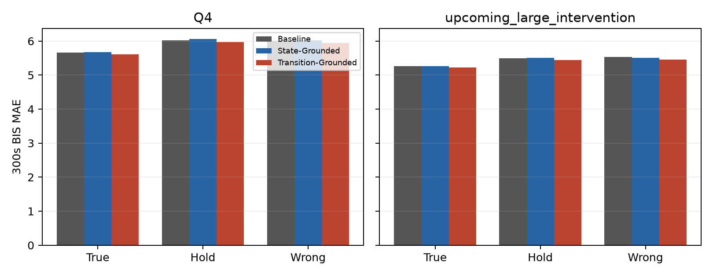

Decision: STOP
State-level supervision explains the main MAP representation gain, while neither auxiliary condition delivers a meaningful forecast gain.

Outcome C. This is a seed-0 feasibility judgment, not a causal claim.

## Cohort and protocol
495 cases, 493 patients; patient-disjoint case split {'train': 345, 'val': 74, 'test': 76}; eligible windows {'train': 370566, 'val': 79574, 'test': 83198}; 74 represented TEST patients. 10-second samples, 180-step history, 30-step future.
Tracks are BIS/BIS, Solar8000/HR, the Round-1 arterial/cuff MAP priority, Orchestra/PPF20_RATE or VOL, Orchestra/RFTN20_RATE or VOL, and Orchestra/PPF20_CE and RFTN20_CE for post-hoc reference only. The retained cases used 489 RATE/RATE, 4 VOL/VOL, and 2 PPF VOL/RFTN RATE pairs; MAP sources were 335 ART_MBP, 157 NIBP_MBP, and 3 FEM_MBP. Numeric samples use latest prior observation with maximum age 60 s; leading/long gaps remain missing with masks. The original RATE/VOL preprocessing, normalization, masks, age/sex/weight/height, and observed prospective future actions were reused unchanged. CE is device-computed TCI reference and was excluded from training. All models deploy the same 58,946-parameter backbone; the two 2,179-parameter heads are removed at inference.
Selected λ: State=0.01, Transition=0.01 using VAL full-trajectory BIS MAE; 0.01 absolute MAE tie tolerance favored smaller λ.

## Main decision table
| Metric | Baseline | State-Grounded | Transition-Grounded |
|---|---:|---:|---:|
| Current BIS R² | 0.986 | 0.989 | 0.985 |
| Current MAP R² | 0.924 | 0.981 | 0.979 |
| Current HR R² | 0.983 | 0.977 | 0.979 |
| 300s ΔBIS R² | 0.374 | 0.383 | 0.397 |
| 300s ΔMAP R² | 0.083 | 0.200 | 0.227 |
| 300s ΔHR R² | 0.356 | 0.350 | 0.360 |
| Same−opposite cosine | 0.040 | 0.052 | 0.055 |
| Triplet accuracy | 0.543 | 0.544 | 0.549 |
| Pair-distance Spearman | 0.167 | 0.148 | 0.175 |
| 300s BIS MAE | 5.028 | 5.023 | 4.964 |
| Full 5m BIS MAE | 4.310 | 4.310 | 4.272 |

## Forecasts and training
| model | target | horizon_seconds | mae | rmse | patients |
|---|---|---|---|---|---|
| Baseline | BIS | 30 | 3.335 | 4.488 | 74 |
| Baseline | BIS | 60 | 3.804 | 5.108 | 74 |
| Baseline | BIS | 180 | 4.592 | 6.247 | 74 |
| Baseline | BIS | 300 | 5.028 | 6.944 | 74 |
| Baseline | BIS | 0 | 4.310 | 5.933 | 74 |
| Baseline | MAP | 30 | 3.169 | 8.007 | 56 |
| Baseline | MAP | 60 | 3.763 | 8.616 | 56 |
| Baseline | MAP | 180 | 5.450 | 9.851 | 56 |
| Baseline | MAP | 300 | 6.449 | 10.723 | 56 |
| Baseline | MAP | 0 | 4.956 | 9.510 | 56 |
| State-Grounded | BIS | 30 | 3.325 | 4.476 | 74 |
| State-Grounded | BIS | 60 | 3.796 | 5.103 | 74 |
| State-Grounded | BIS | 180 | 4.597 | 6.275 | 74 |
| State-Grounded | BIS | 300 | 5.023 | 6.973 | 74 |
| State-Grounded | BIS | 0 | 4.310 | 5.953 | 74 |
| State-Grounded | MAP | 30 | 3.161 | 7.999 | 56 |
| State-Grounded | MAP | 60 | 3.765 | 8.608 | 56 |
| State-Grounded | MAP | 180 | 5.476 | 9.868 | 56 |
| State-Grounded | MAP | 300 | 6.521 | 10.791 | 56 |
| State-Grounded | MAP | 0 | 4.983 | 9.531 | 56 |
| Transition-Grounded | BIS | 30 | 3.318 | 4.474 | 74 |
| Transition-Grounded | BIS | 60 | 3.785 | 5.093 | 74 |
| Transition-Grounded | BIS | 180 | 4.547 | 6.189 | 74 |
| Transition-Grounded | BIS | 300 | 4.964 | 6.847 | 74 |
| Transition-Grounded | BIS | 0 | 4.272 | 5.881 | 74 |
| Transition-Grounded | MAP | 30 | 3.161 | 8.005 | 56 |
| Transition-Grounded | MAP | 60 | 3.762 | 8.622 | 56 |
| Transition-Grounded | MAP | 180 | 5.453 | 9.843 | 56 |
| Transition-Grounded | MAP | 300 | 6.489 | 10.725 | 56 |
| Transition-Grounded | MAP | 0 | 4.966 | 9.506 | 56 |
Long-horizon gains (positive favors the grounded model; Growth is MAE at 300s minus MAE at 30s):
| model | target | horizon_seconds | gain_mae | baseline_growth_30_to_300 | model_growth_30_to_300 |
|---|---|---|---|---|---|
| State-Grounded | BIS | 30 | 0.011 | 1.692 | 1.699 |
| State-Grounded | BIS | 60 | 0.008 | 1.692 | 1.699 |
| State-Grounded | BIS | 180 | -0.005 | 1.692 | 1.699 |
| State-Grounded | BIS | 300 | 0.004 | 1.692 | 1.699 |
| State-Grounded | MAP | 30 | 0.008 | 3.280 | 3.361 |
| State-Grounded | MAP | 60 | -0.002 | 3.280 | 3.361 |
| State-Grounded | MAP | 180 | -0.027 | 3.280 | 3.361 |
| State-Grounded | MAP | 300 | -0.073 | 3.280 | 3.361 |
| Transition-Grounded | BIS | 30 | 0.017 | 1.692 | 1.646 |
| Transition-Grounded | BIS | 60 | 0.020 | 1.692 | 1.646 |
| Transition-Grounded | BIS | 180 | 0.045 | 1.692 | 1.646 |
| Transition-Grounded | BIS | 300 | 0.064 | 1.692 | 1.646 |
| Transition-Grounded | MAP | 30 | 0.008 | 3.280 | 3.328 |
| Transition-Grounded | MAP | 60 | 0.002 | 3.280 | 3.328 |
| Transition-Grounded | MAP | 180 | -0.003 | 3.280 | 3.328 |
| Transition-Grounded | MAP | 300 | -0.040 | 3.280 | 3.328 |
All λ runs and epoch diagnostics (forecast/grounding loss, validation BIS/MAP, gradient/latent norms, head output scale) are in `training_runs.csv` and `lambda_selection.csv`.
Stability check: all diagnostics finite=True; minimum head output SD=0.211; maximum latent norm=8.894; maximum rollout displacement norm=8.751; maximum clipped-precheck gradient norm=0.837.
All λ TEST points below are descriptive; validation alone selected the checkpoints:
| model | lambda_weight | selected | delta_bis_r2_300s | bis_mae_300s |
|---|---|---|---|---|
| State-Grounded | 0.010 | True | 0.383 | 5.023 |
| State-Grounded | 0.100 | False | 0.400 | 4.919 |
| State-Grounded | 1.000 | False | 0.388 | 5.000 |
| Transition-Grounded | 0.010 | True | 0.397 | 4.964 |
| Transition-Grounded | 0.100 | False | 0.408 | 4.915 |
| Transition-Grounded | 1.000 | False | 0.398 | 4.924 |
| Baseline | 0.000 | True | 0.374 | 5.028 |
At λ=0.1, the nonselected State-Grounded and Transition-Grounded TEST 300s BIS MAEs are nearly identical. These TEST values did not change λ selection.
Small nonlinear probe at 300s:
| model | target | r2 | mae |
|---|---|---|---|
| Baseline | BIS | 0.382 | 5.028 |
| Baseline | MAP | 0.126 | 4.911 |
| Baseline | HR | 0.386 | 6.573 |
| State-Grounded | BIS | 0.397 | 4.976 |
| State-Grounded | MAP | 0.240 | 4.466 |
| State-Grounded | HR | 0.373 | 6.666 |
| Transition-Grounded | BIS | 0.403 | 4.940 |
| Transition-Grounded | MAP | 0.247 | 4.425 |
| Transition-Grounded | HR | 0.380 | 6.621 |

## Paired patient-cluster comparisons
Positive R² difference favors Transition-Grounded; negative MAE difference favors it. Intervals are 1,000 patient-cluster bootstrap percentiles.
| comparison | metric | difference | ci_low | ci_high | patients |
|---|---|---|---|---|---|
| Transition-Grounded minus Baseline | 300s_delta_BIS_r2 | 0.024 | 0.008 | 0.043 | 74 |
| Transition-Grounded minus Baseline | 300s_delta_MAP_r2 | 0.144 | 0.120 | 0.172 | 74 |
| Transition-Grounded minus Baseline | 300s_delta_HR_r2 | 0.005 | -0.007 | 0.017 | 56 |
| Transition-Grounded minus Baseline | 300s_BIS_mae | -0.064 | -0.113 | -0.024 | 74 |
| Transition-Grounded minus Baseline | 300s_MAP_mae | 0.040 | -0.020 | 0.105 | 56 |
| Transition-Grounded minus Baseline | triplet_accuracy | 0.006 | -0.004 | 0.016 | 56 |
| Transition-Grounded minus Baseline | BIS_same_minus_opposite_cosine | 0.015 | 0.010 | 0.020 | 74 |
| Transition-Grounded minus State-Grounded | 300s_delta_BIS_r2 | 0.015 | 0.001 | 0.035 | 74 |
| Transition-Grounded minus State-Grounded | 300s_delta_MAP_r2 | 0.027 | 0.011 | 0.045 | 74 |
| Transition-Grounded minus State-Grounded | 300s_delta_HR_r2 | 0.010 | -0.005 | 0.027 | 56 |
| Transition-Grounded minus State-Grounded | 300s_BIS_mae | -0.060 | -0.129 | -0.013 | 74 |
| Transition-Grounded minus State-Grounded | 300s_MAP_mae | -0.032 | -0.115 | 0.031 | 56 |
| Transition-Grounded minus State-Grounded | triplet_accuracy | 0.005 | -0.005 | 0.015 | 56 |
| Transition-Grounded minus State-Grounded | BIS_same_minus_opposite_cosine | 0.003 | -0.002 | 0.008 | 74 |

## Intervention and action audits
| model | subset | bis_forecast_mae | probe_r2 | patients |
|---|---|---|---|---|
| Baseline | overall | 5.028 | 0.374 | 74 |
| Baseline | stable_action_Q1 | 5.741 | 0.307 | 74 |
| Baseline | Q4 | 5.660 | 0.420 | 74 |
| Baseline | upcoming_large_intervention | 5.264 | 0.421 | 74 |
| Baseline | initiation | 5.281 | 0.516 | 71 |
| Baseline | increase | 5.589 | 0.482 | 67 |
| Baseline | decrease | 5.061 | 0.380 | 74 |
| Baseline | stop | 6.775 | 0.545 | 35 |
| Baseline | high_rate_tail | 5.740 | 0.428 | 73 |
| Baseline | non_tail | 4.865 | 0.337 | 74 |
| State-Grounded | overall | 5.023 | 0.383 | 74 |
| State-Grounded | stable_action_Q1 | 5.640 | 0.355 | 74 |
| State-Grounded | Q4 | 5.665 | 0.431 | 74 |
| State-Grounded | upcoming_large_intervention | 5.262 | 0.433 | 74 |
| State-Grounded | initiation | 5.327 | 0.524 | 71 |
| State-Grounded | increase | 5.537 | 0.525 | 67 |
| State-Grounded | decrease | 5.041 | 0.391 | 74 |
| State-Grounded | stop | 6.715 | 0.567 | 35 |
| State-Grounded | high_rate_tail | 5.774 | 0.431 | 73 |
| State-Grounded | non_tail | 4.853 | 0.346 | 74 |
| Transition-Grounded | overall | 4.964 | 0.397 | 74 |
| Transition-Grounded | stable_action_Q1 | 5.544 | 0.384 | 74 |
| Transition-Grounded | Q4 | 5.613 | 0.442 | 74 |
| Transition-Grounded | upcoming_large_intervention | 5.223 | 0.441 | 74 |
| Transition-Grounded | initiation | 5.206 | 0.543 | 71 |
| Transition-Grounded | increase | 5.541 | 0.517 | 67 |
| Transition-Grounded | decrease | 5.013 | 0.395 | 74 |
| Transition-Grounded | stop | 6.826 | 0.572 | 35 |
| Transition-Grounded | high_rate_tail | 5.695 | 0.447 | 73 |
| Transition-Grounded | non_tail | 4.785 | 0.367 | 74 |
Response-order triplet accuracy by intervention subgroup at 300s:
| representation | subset | triplet_accuracy | patients |
|---|---|---|---|
| Baseline | stable_action_Q1 | 0.554 | 56 |
| Baseline | Q4 | 0.552 | 56 |
| Baseline | upcoming_large_intervention | 0.555 | 56 |
| Baseline | initiation | 0.583 | 53 |
| Baseline | increase | 0.544 | 50 |
| Baseline | decrease | 0.558 | 56 |
| Baseline | stop | 0.610 | 25 |
| Baseline | high_rate_tail | 0.572 | 55 |
| Baseline | non_tail | 0.546 | 56 |
| State-Grounded | stable_action_Q1 | 0.544 | 56 |
| State-Grounded | Q4 | 0.552 | 56 |
| State-Grounded | upcoming_large_intervention | 0.574 | 56 |
| State-Grounded | initiation | 0.576 | 53 |
| State-Grounded | increase | 0.546 | 50 |
| State-Grounded | decrease | 0.562 | 56 |
| State-Grounded | stop | 0.596 | 25 |
| State-Grounded | high_rate_tail | 0.568 | 55 |
| State-Grounded | non_tail | 0.565 | 56 |
| Transition-Grounded | stable_action_Q1 | 0.539 | 56 |
| Transition-Grounded | Q4 | 0.562 | 56 |
| Transition-Grounded | upcoming_large_intervention | 0.571 | 56 |
| Transition-Grounded | initiation | 0.576 | 53 |
| Transition-Grounded | increase | 0.545 | 50 |
| Transition-Grounded | decrease | 0.554 | 56 |
| Transition-Grounded | stop | 0.600 | 25 |
| Transition-Grounded | high_rate_tail | 0.595 | 55 |
| Transition-Grounded | non_tail | 0.561 | 56 |
| model | condition | subset | mae | patients | windows |
|---|---|---|---|---|---|
| Baseline | true | Q4 | 5.659 | 74 | 20642 |
| Baseline | true | upcoming_large_intervention | 5.267 | 74 | 26466 |
| Baseline | hold | Q4 | 6.023 | 74 | 20642 |
| Baseline | hold | upcoming_large_intervention | 5.496 | 74 | 26466 |
| Baseline | wrong | Q4 | 6.010 | 74 | 20642 |
| Baseline | wrong | upcoming_large_intervention | 5.526 | 74 | 26466 |
| State-Grounded | true | Q4 | 5.669 | 74 | 20642 |
| State-Grounded | true | upcoming_large_intervention | 5.268 | 74 | 26466 |
| State-Grounded | hold | Q4 | 6.061 | 74 | 20642 |
| State-Grounded | hold | upcoming_large_intervention | 5.502 | 74 | 26466 |
| State-Grounded | wrong | Q4 | 6.017 | 74 | 20642 |
| State-Grounded | wrong | upcoming_large_intervention | 5.507 | 74 | 26466 |
| Transition-Grounded | true | Q4 | 5.606 | 74 | 20642 |
| Transition-Grounded | true | upcoming_large_intervention | 5.218 | 74 | 26466 |
| Transition-Grounded | hold | Q4 | 5.970 | 74 | 20642 |
| Transition-Grounded | hold | upcoming_large_intervention | 5.441 | 74 | 26466 |
| Transition-Grounded | wrong | Q4 | 5.938 | 74 | 20642 |
| Transition-Grounded | wrong | upcoming_large_intervention | 5.453 | 74 | 26466 |

## CE reference probes
| model | target | r2 | mae | patients |
|---|---|---|---|---|
| Baseline | PPF_CE | 0.692 | 0.121 | 74 |
| Baseline | RFTN_CE | 0.572 | 0.236 | 74 |
| State-Grounded | PPF_CE | 0.681 | 0.121 | 74 |
| State-Grounded | RFTN_CE | 0.558 | 0.238 | 74 |
| Transition-Grounded | PPF_CE | 0.653 | 0.125 | 74 |
| Transition-Grounded | RFTN_CE | 0.497 | 0.256 | 74 |
These are post-hoc predictive probes of device-computed TCI states, not measured concentrations or causal pharmacology.

## Six research questions
1. Can geometry change? 300s ΔBIS R² changed by 0.024, and triplet accuracy by 0.006 versus Baseline; the full horizon and cosine results are in the CSVs.
2. Is the change transition-specific? State-Grounded changed ΔBIS R² by 0.009 and 300s BIS MAE by -0.004; Transition-Grounded changed MAE by -0.064. The paired Transition−State comparisons are reported above.
3. Functional benefit? 300s BIS MAE gain versus Baseline was 0.064 with a patient-bootstrap interval excluding zero, but it is below the practical guidance of roughly 0.15–0.20 BIS points; MAP did not improve. Subgroup gains are small and inconsistent.
4. Action sensitivity preserved? Yes on matched-donor Q4 and upcoming-change windows. Both Q4 and upcoming-change corruption metrics are above.
5. Exposure versus response? At 300s PPF CE ΔR² is Baseline 0.692, State-Grounded 0.681, Transition-Grounded 0.653; RFTN CE ΔR² is Baseline 0.572, State-Grounded 0.558, Transition-Grounded 0.497. Transition grounding improved ΔMAP decoding but the State control captured most of that gain, while CE decoding weakened, especially for RFTN. This does not establish a generally richer intervention-response model or causal pharmacology.
6. Project decision? STOP; Outcome C. A single seed and one dataset cannot establish external robustness.

## Figures

## Limits
The grounded models add supervised HR transition labels, while the deployed decoder forecasts BIS/MAP. This diagnoses representation and forecasting behavior; it does not identify treatment effects. Some standardized latent features were highly collinear, causing Ridge Cholesky conditioning warnings; scores were finite and the same TRAIN/VAL alpha protocol was applied across models, but small probe differences should be treated cautiously. λ was selected only on validation forecasts, and the seed-0 result requires replication before a general claim.
